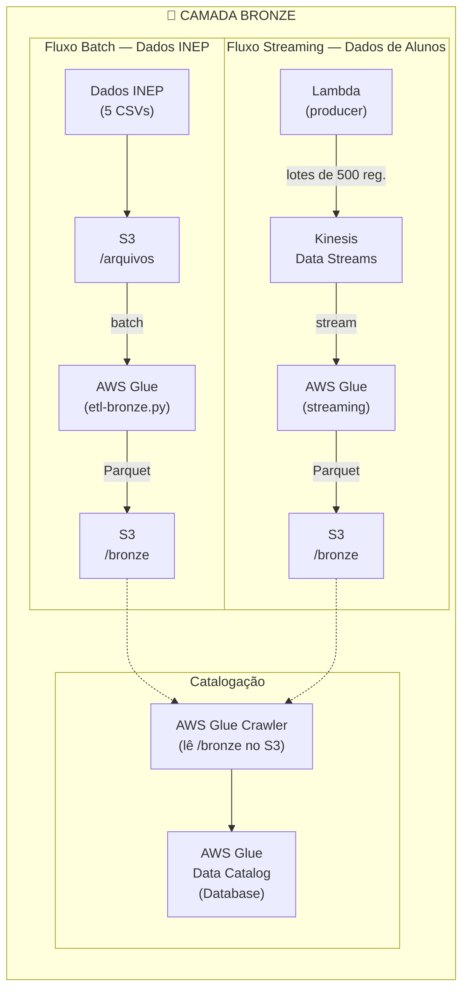
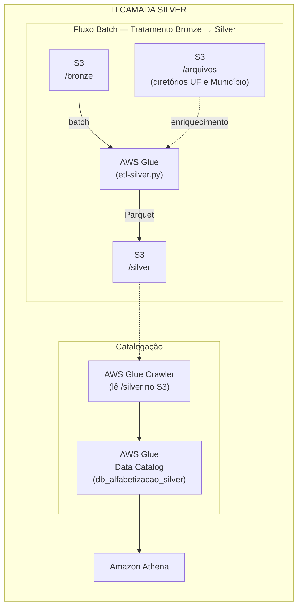
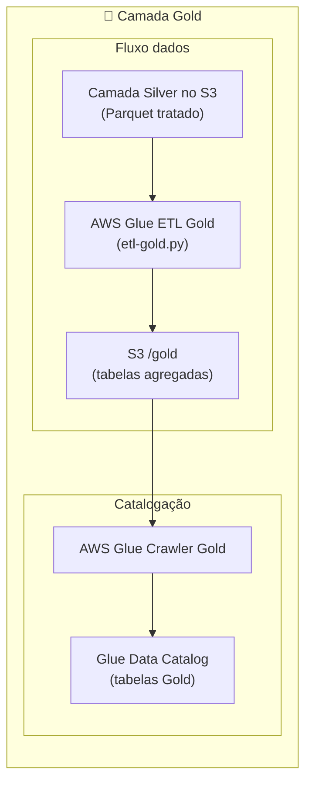
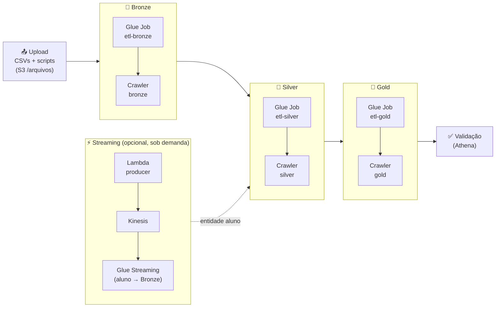

# [FIAP - Fase2] Tech Challenge: Análise de Alfabetização no Brasil


Grupo: Eduardo Rossi | Luis Loschi | Luiza Santos | Vitória Santos | Vyctor Correia

Projeto desenvolvido para o **Tech Challenge da Fase 2 da FIAP (IA Scientist)**, com o objetivo de construir uma pipeline de dados no modelo **arquitetura medalhão** (Bronze → Silver → Gold) utilizando a **AWS** como provedor de nuvem.

## 📌 Sumário
- [Objetivo do Projeto](#objetivo-do-projeto)
- [Contexto do Problema](#contexto-do-problema)
- [Descrição da base de dados](#descricao-da-base-de-dados)
- [Estrutura do Repositório](#estrutura-do-repositório)
- [Arquitetura da Solução](#arquitetura-da-solução)
  - [Arquitetura Medalhão - Camada Bronze](#arquitetura-bronze)
    - [Arquitetura AWS](#arquitetura-aws--camada-bronze)
    - [Scripts](#scripts)
    - [Estrutura de Pastas no S3](#estrutura-de-pastas-no-s3)
    - [Configuração dos Serviços AWS](#configuracao-dos-servicos-aws)
      - [Pré-requisitos — IAM Role](#pré-requisitos--iam-role)
      - [Amazon S3](#1-amazon-s3)
      - [Amazon Kinesis Data Streams](#2-amazon-kinesis-data-streams)
      - [AWS Lambda — Producer](#3-aws-lambda--producer)
      - [AWS Glue — Job Batch (ETL Bronze)](#4-aws-glue--job-batch-etl-bronze)
      - [AWS Glue — Job Streaming](#5-aws-glue--job-streaming)
      - [AWS Glue — Crawler](#6-aws-glue--crawler)
  - [Arquitetura Medalhão - Camada Silver](#arquitetura-silver)
      - [Arquitetura AWS](#arquitetura-aws--camada-silver)
      - [Scripts](#scripts-silver)
      - [Estrutura de Pastas no S3](#estrutura-de-pastas-no-s3-silver)
      - [Configuração dos Serviços AWS](#configuracao-dos-servicos-aws-silver)
  - [Arquitetura Medalhão - Camada Gold](#arquitetura-gold)
      - [Arquitetura AWS](#arquitetura-aws--camada-gold)
      - [Scripts](#scripts-gold)
      - [Estrutura de Pastas no S3](#estrutura-de-pastas-no-s3-gold)
      - [Configuração dos Serviços AWS](#configuracao-dos-servicos-aws-gold)
- [Tecnologias Utilizadas](#tecnologias-utilizadas)
- [Decisões Arquiteturais](#decisoes-arquiteturais)
- [Monitoramento da Pipeline](#monitoramento)
- [FinOps - Otimização de Custos](#finops---otimização-de-custos)
- [Aplicação em IA](#aplicação-em-ia)
- [Principais análises realizadas](#principais-analises-realizadas)
- [Limitações](#limitacoes)
- [Próximos passos](#proximos-passos)
- [Entrega Executiva](#entrega-executiva)
- [Resumo executivo](#resumo-executivo)
- [Conclusão](#conclusao)

<a id="objetivo-do-projeto"></a>
## 🎯 Objetivo do Projeto
Construir uma pipeline escalável que realize:
- Ingestão de diferentes fontes de dados educacionais.  
- Tratamento e padronização das informações.  
- Integração entre bases heterogêneas.  
- Disponibilização de uma camada analítica confiável.  
- Monitoramento operacional do pipeline.  
- Controle de custos da infraestrutura (FinOps).  

<a id="contexto-do-problema"></a>
## 📃 Contexto do Problema
A alfabetização na infância é um dos pilares fundamentais para o desenvolvimento educacional, social e econômico de um país. O **Compromisso Nacional Criança Alfabetizada** busca garantir que todas as crianças brasileiras estejam alfabetizadas até o final do 2º ano do ensino fundamental.  

Em 2023, o **INEP** definiu o ponto de corte de **743 pontos na escala Saeb** como referência para considerar uma criança alfabetizada. A partir disso, foi criado o **Indicador Criança Alfabetizada**, que expressa o percentual de estudantes que atingem esse patamar de proficiência.  

Nosso desafio é construir uma **pipeline híbrida (Batch + Streaming)** em nuvem, seguindo a **Arquitetura Medalhão (Bronze, Silver, Gold)**, para integrar diferentes fontes de dados educacionais e apoiar políticas públicas baseadas em evidências.

<a id="descricao-da-base-de-dados"></a>
## 📝 Descrição da base de dados

Os arquivos utilizados são disponibilizados publicamente pelo [INEP](https://www.gov.br/inep/pt-br) e referem-se à **Avaliação de Alfabetização (ALFA)**:

| Arquivo CSV | Descrição | Ingestão |
|---|---|---|
| `br_inep_avaliacao_alfabetizacao_uf.csv` | Taxas e médias de alfabetização por UF | Batch |
| `br_inep_avaliacao_alfabetizacao_municipio.csv` | Taxas e médias de alfabetização por município | Batch |
| `br_inep_avaliacao_alfabetizacao_meta_alfabetizacao_brasil.csv` | Metas nacionais de alfabetização (2024–2030) | Batch |
| `br_inep_avaliacao_alfabetizacao_meta_alfabetizacao_uf.csv` | Metas de alfabetização por UF (2024–2030) | Batch |
| `br_inep_avaliacao_alfabetizacao_meta_alfabetizacao_municipio.csv` | Metas de alfabetização por município (2024–2030) | Batch |
| `br_inep_avaliacao_alfabetizacao_aluno.csv` | Dados individuais de alunos | Streaming (Kinesis) |

Os arquivos ficam armazenados no S3 sob o prefixo `s3://<BUCKET_NAME>/arquivos/`.

**Os arquivos utilizados também podem ser baixados clicando no link:** 🔗[Download base de dados](https://drive.google.com/file/d/16tnS_J9I_r2oTVbugjK_q1svYGd6tj2n/view?usp=sharing)

<a id="estrutura-do-repositório"></a>

## 📁 Estrutura do Repositório

```text
.
├── data/
|   └── fonte-apoio/
│       ├── br_bd_diretorios_brasil_municipio.csv
│       └── br_bd_diretorios_brasil_uf.csv
|   └── fonte-dados/
│       ├── br_inep_avaliacao_alfabetizacao_uf.csv
│       ├── br_inep_avaliacao_alfabetizacao_municipio.csv
│       ├── br_inep_avaliacao_alfabetizacao_meta_alfabetizacao_brasil.csv
│       ├── br_inep_avaliacao_alfabetizacao_meta_alfabetizacao_uf.csv
│       ├── br_inep_avaliacao_alfabetizacao_meta_alfabetizacao_municipio.csv
│       └── br_inep_avaliacao_alfabetizacao_aluno.csv
├── scripts/
|   └── deploy/
│       ├── deploy.sh (automação da pipeline via AWS CLI)
│       └── README.md (como usar o deploy.sh)
├── src/
|   └── bronze/
│       ├── etl-bronze.py
│       ├── producer-student-data.py
│       └── glue-streaming-job.py
|   └── silver/
│       └── etl-silver.py
|   └── gold/
│       └── etl-gold.py
├── .gitignore
└── README.md
```

🔗[Download base de dados](https://drive.google.com/file/d/16tnS_J9I_r2oTVbugjK_q1svYGd6tj2n/view?usp=sharing)

<a id="arquitetura-da-solução"></a>
## 🏗️ Arquitetura da Solução

<a id="arquitetura-bronze"></a>
### 🥉 Arquitetura Medalhão — Camada Bronze 

> **Papel da camada:** cópia **bruta e imutável** das fontes — o dado exatamente como veio do INEP, apenas convertido para Parquet, particionado por `ano` e carimbado com colunas de auditoria (`_ingestion_*`, `_source_*`) que registram quando e de onde cada registro entrou. O único tratamento é o **schema explícito na leitura** (tipos declarados por entidade), para que uma mudança na fonte quebre o job na ingestão — e não silenciosamente nas camadas seguintes. A Bronze **não corrige, não deduplica e não enriquece**: preservar o dado original é o que permite reprocessar Silver e Gold do zero a qualquer momento.

<a id="arquitetura-aws--camada-bronze"></a>
### Arquitetura AWS 
---



<a id="scripts"></a>
### Scripts
---

### [`src/bronze/etl-bronze.py`](src/bronze/etl-bronze.py) — AWS Glue Job (Batch)

Job do **AWS Glue** responsável por ler os 5 arquivos CSV do INEP armazenados no S3, aplicar schema enforcement e gravar os dados em formato **Parquet** particionado por `ano` na camada Bronze.

**O que faz:**
- Recebe o nome do bucket via parâmetro de job `--BUCKET_NAME`
- Lê cada CSV com schema explícito via PySpark, tratando valores nulos e vazios com `nullValue` / `emptyValue`
- Adiciona colunas de auditoria: `_ingestion_date`, `_ingestion_timestamp`, `_source_path`, `_source_entity`
- Salva em Parquet com `partitionBy("ano")` e `mode("overwrite")`
- Destino: `s3://<BUCKET_NAME>/bronze/<nome_entidade>/ano=XXXX/`

**Entidades processadas:**

| Entidade (pasta Bronze) | Arquivo de origem |
|---|---|
| `avaliacao_alfabetizacao_uf` | `br_inep_avaliacao_alfabetizacao_uf.csv` |
| `avaliacao_alfabetizacao_municipio` | `br_inep_avaliacao_alfabetizacao_municipio.csv` |
| `avaliacao_alfabetizacao_meta_alfabetizacao_brasil` | `br_inep_avaliacao_alfabetizacao_meta_alfabetizacao_brasil.csv` |
| `avaliacao_alfabetizacao_meta_alfabetizacao_uf` | `br_inep_avaliacao_alfabetizacao_meta_alfabetizacao_uf.csv` |
| `avaliacao_alfabetizacao_meta_alfabetizacao_municipio` | `br_inep_avaliacao_alfabetizacao_meta_alfabetizacao_municipio.csv` |


### [`src/bronze/producer-student-data.py`](src/bronze/producer-student-data.py) — AWS Lambda (Producer Kinesis)

Função **AWS Lambda** que simula a chegada gradual de dados de alunos, lendo o arquivo `br_inep_avaliacao_alfabetizacao_aluno.csv` do S3 e enviando os registros em lotes para o **Amazon Kinesis Data Streams**.

**O que faz:**
- Lê configuração via **variáveis de ambiente** (`BUCKET_NAME`, `CSV_PATH`, `AWS_REGION`)
- Faz download do CSV do S3 para `/tmp/aluno.csv`
- Envia registros em lotes de 500 para o stream `stream-alfabetizacao-aluno`
- Usa `id_aluno` como partition key do Kinesis (fallback: `"default"`)
- Aguarda 0.3s entre lotes para simular chegada gradual de dados

### [`src/bronze/glue-streaming-job.py`](src/bronze/glue-streaming-job.py) — AWS Glue Streaming Job

Job do **AWS Glue** em modo streaming que consome os registros do **Amazon Kinesis**, aplica transformações e persiste na camada Bronze.

**O que faz:**
- Recebe `--BUCKET_NAME` e `--REGION` como parâmetros de job
- Lê do Kinesis (`TRIM_HORIZON`) com trigger de **30 segundos**
- Deserializa o payload JSON recebido no campo `data` (binário → string → JSON)
- Trata colunas numéricas que podem chegar vazias: `preenchimento_caderno`, `alfabetizado`, `proficiencia`, `peso_aluno`
- Adiciona colunas de auditoria: `_ingestion_date`, `_ingestion_timestamp`, `_source_entity`
- Salva em Parquet com `partitionBy("ano")` e `mode("append")`
- Checkpoint no S3 para resiliência: `s3://<BUCKET_NAME>/checkpoints/avaliacao_alfabetizacao_aluno/`

<a id="estrutura-de-pastas-no-s3"></a>
### Estrutura de Pastas no S3
---

```
s3://<BUCKET_NAME>/
├── arquivos/
│   ├── br_inep_avaliacao_alfabetizacao_uf.csv
│   ├── br_inep_avaliacao_alfabetizacao_municipio.csv
│   ├── br_inep_avaliacao_alfabetizacao_meta_alfabetizacao_brasil.csv
│   ├── br_inep_avaliacao_alfabetizacao_meta_alfabetizacao_uf.csv
│   ├── br_inep_avaliacao_alfabetizacao_meta_alfabetizacao_municipio.csv
│   └── br_inep_avaliacao_alfabetizacao_aluno.csv
│
├── bronze/
│   ├── avaliacao_alfabetizacao_uf/ano=XXXX/
│   ├── avaliacao_alfabetizacao_municipio/ano=XXXX/
│   ├── avaliacao_alfabetizacao_meta_alfabetizacao_brasil/ano=XXXX/
│   ├── avaliacao_alfabetizacao_meta_alfabetizacao_uf/ano=XXXX/
│   ├── avaliacao_alfabetizacao_meta_alfabetizacao_municipio/ano=XXXX/
│   └── avaliacao_alfabetizacao_aluno/ano=XXXX/
│
├── checkpoints/
│   └── avaliacao_alfabetizacao_aluno/
│
└── scripts/
    ├── etl-bronze.py
    ├── glue-streaming-job.py
    └── producer-student-data.py
```

<a id="configuracao-dos-servicos-aws"></a>
### Configuração dos Serviços AWS
---

> **Região utilizada:** `us-east-1`

Há **duas formas** de provisionar e executar a pipeline:

| Forma | Quando usar | Onde |
|---|---|---|
| 🤖 **Automatizada (AWS CLI)** | Subir tudo de forma reproduzível por linha de comando | [`scripts/deploy/`](scripts/deploy/README.md) — script `deploy.sh` idempotente |
| 🖱️ **Manual (Console web)** | Entender e configurar serviço por serviço | As subseções abaixo |

As subseções a seguir descrevem a configuração **manual no console**, que também serve de referência para os valores usados pelo script.

<a id="pré-requisitos--iam-role"></a>
### Pré-requisitos — IAM Role
---

Todos os serviços abaixo compartilham a mesma role(`LabRole`) com as seguintes permissões:

| Política | Finalidade |
|---|---|
| `AmazonS3FullAccess` | Leitura e escrita no bucket |
| `AWSGlueServiceRole` | Execução dos jobs e crawlers do Glue |
| `AmazonKinesisFullAccess` | Leitura/escrita no Data Stream |
| `AWSLambdaBasicExecutionRole` | Logs da Lambda no CloudWatch |

> No ambiente **AWS Academy / Learner Lab**, use a role `LabRole` já existente.

<a id="1-amazon-s3"></a>
### 1. Amazon S3
---

**Console → S3 → Create bucket**

| Campo | Valor |
|---|---|
| Bucket name | `<seu-bucket-name>` (ex: `fiap-tech-challenge-2-<account-id>-us-east-1`) |
| Region | `us-east-1` |
| Block public access | Mantido ativado (padrão) |

Após criar o bucket, faça upload dos arquivos CSV do INEP para o prefixo `arquivos/` e dos scripts `.py` para `scripts/`.

<a id="2-amazon-kinesis-data-streams"></a>
### 2. Amazon Kinesis Data Streams
---

**Console → Kinesis → Data Streams → Create data stream**

| Campo | Valor |
|---|---|
| Data stream name | `stream-alfabetizacao-aluno` |
| Capacity mode | **On-demand** (recomendado para o volume do INEP) |
| Region | `us-east-1` |

> O nome do stream está fixo nos scripts (`STREAM_NAME = "stream-alfabetizacao-aluno"`). Caso altere, atualize todos os três arquivos.

<a id="3-aws-lambda--producer"></a>
### 3. AWS Lambda — Producer
---

**Console → Lambda → Create function**

#### Criação

| Campo | Valor |
|---|---|
| Function name | `producer-student-data` |
| Runtime | `Python 3.12` |
| Architecture | `x86_64` |
| Execution role | `LabRole` |

#### Código

Copie o conteúdo de `src/bronze/producer-student-data.py` diretamente no editor inline ou faça upload como arquivo `.zip`. Após copiar, clique no botão **'Deploy'**.

#### Variáveis de ambiente

**Configuration → Environment variables → Edit → Add environment variable**

| Chave | Valor |
|---|---|
| `BUCKET_NAME` | `<seu-bucket-name>` |
| `CSV_PATH` | `arquivos/br_inep_avaliacao_alfabetizacao_aluno.csv` |
| `AWS_REGION` | `us-east-1` |

> `AWS_REGION` é injetada automaticamente pelo Lambda. Defini-la explicitamente garante consistência com o cliente boto3.

#### Timeout e memória

O arquivo de alunos é grande. Ajuste em **Configuration → General configuration**:

| Campo | Valor recomendado |
|---|---|
| Timeout | `15 min` (máximo do Lambda) |
| Memory | `512 MB` |
| Ephemeral storage (/tmp) | `1024 MB` (ou mais, conforme tamanho do CSV) |

<a id="4-aws-glue--job-batch-etl-bronze"></a>
### 4. AWS Glue — Job Batch (ETL Bronze)
---

**Console → AWS Glue → ETL Jobs → Script editor → Create new script**

#### Criação

| Campo | Valor |
|---|---|
| Job name | `etl-bronze-alfabetizacao` |
| IAM Role | `LabRole` |
| Type | `Spark` |
| Glue version | `Glue 4.0` |
| Language | `Python 3` |
| Script path (S3) | `s3://<seu-bucket>/scripts/etl-bronze.py` |
| Temporary directory | `s3://<seu-bucket>/tmp/` |

#### Parâmetros do Job

**Job details → Advanced properties → Job parameters → Add new parameter**

| Chave | Valor |
|---|---|
| `--BUCKET_NAME` | `<seu-bucket-name>` |

#### Executar

Clique em **Run** no canto superior direito. Acompanhe os logs em **CloudWatch → Log groups → /aws-glue/jobs/output**.

<a id="5-aws-glue--job-streaming"></a>
### 5. AWS Glue — Job Streaming
---

**Console → AWS Glue → ETL Jobs → Script editor → Create new script**

#### Criação

| Campo | Valor |
|---|---|
| Job name | `glue-streaming-alfabetizacao-aluno` |
| IAM Role | `LabRole` |
| Type | `Spark Streaming` |
| Glue version | `Glue 4.0` |
| Language | `Python 3` |
| Script path (S3) | `s3://<seu-bucket>/scripts/glue-streaming-job.py` |
| Temporary directory | `s3://<seu-bucket>/tmp/` |

#### Parâmetros do Job

| Chave | Valor |
|---|---|
| `--BUCKET_NAME` | `<seu-bucket-name>` |
| `--REGION` | `us-east-1` |

> **Checkpoint:** em caso de falha ou necessidade de reprocessar desde o início, apague a pasta `s3://<seu-bucket>/checkpoints/avaliacao_alfabetizacao_aluno/` antes de iniciar o job novamente.

#### Ordem de execução

1. Inicie o **Glue Streaming Job** primeiro (ele ficará aguardando mensagens)
2. Execute a **Lambda** em seguida para começar a produzir dados no Kinesis (Botão Testar)

<a id="6-aws-glue--crawler"></a>
### 6. AWS Glue — Crawler
---

O Crawler cataloga automaticamente as pastas Parquet do S3 como tabelas no **AWS Glue Data Catalog**, tornando os dados consultáveis via **Amazon Athena**.

**Console → AWS Glue → Crawlers → Create crawler**

#### Passo 1 — Set crawler properties

| Campo | Valor |
|---|---|
| Crawler name | `crawler-bronze-alfabetizacao` |

#### Passo 2 — Choose data sources

| Campo | Valor |
|---|---|
| Data source | S3 |
| S3 path | `s3://<seu-bucket>/bronze/` |
| Subsequent crawler runs | `Crawl all sub-folders` |

#### Passo 3 — Configure security settings

| Campo | Valor |
|---|---|
| IAM Role | `LabRole` |

#### Passo 4 — Set output and scheduling

| Campo | Valor |
|---|---|
| Target database | Crie um novo: `db_alfabetizacao_bronze` |
| Table name prefix | `bronze_` *(opcional)* |
| Crawler schedule | `On demand` (execução manual) |

#### Passo 5 — Review e Create

Após criado, clique em **Run crawler**. Ao concluir, as tabelas estarão disponíveis no banco `db_alfabetizacao_bronze` e poderão ser consultadas diretamente no **Amazon Athena**.

> ⚠️ **Observação**: Verifique se os arquivos foram totalmente carregados depois de rodar os scripts, pode levar um tempo antes de validar no Athena!

#### Verificar no Athena

```sql
-- Listar tabelas catalogadas
SHOW TABLES IN db_alfabetizacao_bronze;

-- Exemplo de consulta
-- Obs.: a tabela tem uma linha por (sigla_uf, serie, rede); na Bronze a coluna
-- `rede` é o código de origem do INEP (0, 2, 3, 5). A decodificação para texto
-- (rede_nome) é feita na camada Silver.
-- Obs.: `ano` é coluna de partição (texto no catálogo) — filtre com aspas: '2023'.
SELECT ano, sigla_uf, rede, taxa_alfabetizacao, media_portugues
FROM db_alfabetizacao_bronze.bronze_avaliacao_alfabetizacao_uf
WHERE ano = '2023'
ORDER BY taxa_alfabetizacao DESC
LIMIT 10;
```

<a id="arquitetura-silver"></a>
### 🥈 Arquitetura Medalhão — Camada Silver

> **Papel da camada:** dados **limpos, tipados e padronizados**, prontos para consumo analítico. Cada entidade da Bronze sai daqui com nomes de coluna normalizados, vazios convertidos em `NULL`, tipos corretos (ids como texto para preservar zeros à esquerda), domínios decodificados (`rede_nome`, `serie_nome`), duplicatas removidas pela chave de negócio e nomes de UF/município/região agregados via bases de apoio. A Silver **não calcula indicadores nem agregações de negócio** — ela entrega a matéria-prima confiável; a semântica analítica pertence à Gold.

<a id="arquitetura-aws--camada-silver"></a>
### Arquitetura AWS
---

A camada **Silver** consome os dados Parquet da Bronze, aplica limpeza, padronização, tipagem, deduplicação e enriquecimento dimensional simples, e grava o resultado em Parquet particionado por `ano`.



<a id="scripts-silver"></a>
### Scripts
---

#### [`src/silver/etl-silver.py`](src/silver/etl-silver.py) — AWS Glue Job (Batch)

Job do **AWS Glue** que consome as entidades da camada Bronze, aplica limpeza, padronização, tipagem, decodificação de domínios, deduplicação e enriquecimento dimensional, e grava os dados em formato **Parquet** particionado por `ano` na camada Silver. O processamento é reutilizável e orientado por configuração (uma entrada por entidade).

**O que faz:**
- Recebe o nome do bucket via parâmetro de job `--BUCKET_NAME`
- Lê cada entidade da Bronze em `s3://<BUCKET_NAME>/bronze/<entidade>/` (Parquet)
- Padroniza nomes de colunas (`snake_case`, sem acentos/espaços), preservando colunas técnicas
- Converte strings vazias em `NULL` e remove espaços extras (`trim`)
- Corrige tipos: `ano`/`nivel_alfabetizacao` → inteiro; taxas, médias, proporções, metas e percentuais → `double`; ids e códigos → `string` (preserva zeros à esquerda)
- Decodifica os domínios `rede`/`serie` em `rede_nome`/`serie_nome`, preservando o código original
- Deduplica pela chave de negócio da entidade (com log da diferença de volume)
- Enriquece com as dimensões de apoio (UF e Município): `sigla_uf`, `nome_municipio`, `nome_uf`, `nome_regiao`
- Adiciona colunas de auditoria: `_silver_processing_date`, `_silver_processing_timestamp`, `_silver_source_entity`, `_source_layer`, `_pipeline_stage`
- Salva em Parquet com `partitionBy("ano")` e `mode("overwrite")`
- Destino: `s3://<BUCKET_NAME>/silver/<entidade>/ano=XXXX/`

**Entidades processadas:**

| Entidade (pasta Silver) | Chave de deduplicação | Enriquecimento |
|---|---|---|
| `avaliacao_alfabetizacao_uf` | `ano, sigla_uf, serie, rede` | UF (`nome_uf`, `nome_regiao`) |
| `avaliacao_alfabetizacao_municipio` | `ano, id_municipio, serie, rede` | Município (`sigla_uf`, `nome_municipio`, `nome_uf`, `nome_regiao`) |
| `avaliacao_alfabetizacao_meta_alfabetizacao_brasil` | `ano, rede` | — |
| `avaliacao_alfabetizacao_meta_alfabetizacao_uf` | `ano, sigla_uf, rede` | UF |
| `avaliacao_alfabetizacao_meta_alfabetizacao_municipio` | `ano, id_municipio, rede` | Município |
| `avaliacao_alfabetizacao_aluno` | `ano, id_aluno, id_escola` | Município |

#### Características das fontes de dados

Características das entidades que orientam o contrato de transformação da Silver:

| Tabela | Linhas | Chaves duplicadas | Cobertura do join (apoio) | Observações |
|---|---|---|---|---|
| `uf` | 145 | 0 | 25/25 UFs | `serie` constante (`2`); `rede` ∈ {0,2,3,5} |
| `municipio` | 23.995 | 0 | 5.550/5.550 municípios | sem `sigla_uf` na origem → adicionada via apoio |
| `meta_uf` | 54 | 0 | 27/27 UFs | `rede` = `Pública`; nulos em `taxa` (7,4%) |
| `meta_municipio` | 10.704 | 0 | 5.352/5.352 municípios | `rede` = `Municipal`; `nivel_alfabetizacao` ∈ {0–5} |
| `meta_brasil` | 3 | 0 | n/a | metas nacionais 2024–2030 |
| `aluno` | 3.867.999 | 0 | 5.548/5.548 municípios | `serie`=`2`; `rede` ∈ {2,3,4}; `presenca`/`alfabetizado` ∈ {0,1} |
| `dim_uf` / `dim_municipio` | 27 / 5.571 | chaves únicas | — | `id_municipio` sempre com 7 dígitos |

Tratamentos correspondentes na Silver:

- A deduplicação preserva todos os registros: as chaves de negócio são íntegras nas fontes.
- O enriquecimento dimensional tem **cobertura total** (sem registros órfãos).
- `id_municipio` é mantido como `string` de 7 dígitos.
- Os nulos de `proporcao_aluno_nivel_*` (~48%) representam ausência legítima de informação e são preservados.
- No `aluno`, `proficiencia` e `peso_aluno` são nulos apenas para alunos ausentes (`presenca=0`, ~13%); `alfabetizado` e `presenca` são tipados como inteiro (indicadores 0/1).
- Os arquivos de origem estão em **UTF-8**.

#### Decodificação de domínios (`rede` e `serie`)

A Silver decodifica os códigos do INEP em rótulos legíveis (`rede_nome`, `serie_nome`), **preservando sempre o código original** para rastreabilidade. As tabelas de referência são mantidas no próprio script (`REDE_MAP` / `SERIE_MAP`).

**Dicionário oficial aplicado:**

| `rede` | `rede_nome` |
|---|---|
| 0 | Total (Federal, Estadual, Municipal e Privada) |
| 1 | Federal |
| 2 | Estadual |
| 3 | Municipal |
| 4 | Privada |
| 5 | Pública (Estadual e Municipal) |
| 6 | Pública (Federal, Estadual e Municipal) |

| `serie` | `serie_nome` |
|---|---|
| 2 | 2º ano do Ensino Fundamental |

> ⚠️ **Observação:** nas tabelas de **avaliação** `rede` chega como **código** (decodificado acima); nas tabelas de **meta** `rede` já vem como **texto** (`Pública`, `Municipal`) e é **preservado como está** (o valor textual não consta no de-para e o `COALESCE` mantém a origem). A conversão inversa (texto → código) não é aplicada nesta camada, pois `Pública` na meta não corresponde de forma única ao código `5` (Estadual e Municipal) ou `6` (Federal, Estadual e Municipal). Essa harmonização cabe à camada Gold.

<a id="estrutura-de-pastas-no-s3-silver"></a>
### Estrutura de pastas no S3 — Silver
---

> ⚠️ **Observação:** novos arquivos adicionados: br_bd_diretorios_brasil_municipio.csv e br_bd_diretorios_brasil_uf.csv ([`Arquivos estão na pasta 'data/fonte-apoio' deste repositório`](data/fonte-apoio/))

```text
s3://<BUCKET_NAME>/
├── arquivos/
│   ├── br_inep_avaliacao_alfabetizacao_uf.csv
│   ├── br_inep_avaliacao_alfabetizacao_municipio.csv
│   ├── br_inep_avaliacao_alfabetizacao_meta_alfabetizacao_brasil.csv
│   ├── br_inep_avaliacao_alfabetizacao_meta_alfabetizacao_uf.csv
│   ├── br_inep_avaliacao_alfabetizacao_meta_alfabetizacao_municipio.csv
│   |── br_inep_avaliacao_alfabetizacao_aluno.csv
│   |── br_bd_diretorios_brasil_municipio.csv   [ADICIONADO]
│   └── br_bd_diretorios_brasil_uf.csv          [ADICIONADO]
│
├── bronze/
│   ├── avaliacao_alfabetizacao_uf/ano=XXXX/
│   ├── avaliacao_alfabetizacao_municipio/ano=XXXX/
│   ├── avaliacao_alfabetizacao_meta_alfabetizacao_brasil/ano=XXXX/
│   ├── avaliacao_alfabetizacao_meta_alfabetizacao_uf/ano=XXXX/
│   ├── avaliacao_alfabetizacao_meta_alfabetizacao_municipio/ano=XXXX/
│   └── avaliacao_alfabetizacao_aluno/ano=XXXX/
|
├── silver/
│   ├── avaliacao_alfabetizacao_uf/ano=XXXX/
|   ├── avaliacao_alfabetizacao_municipio/ano=XXXX/
|   ├── avaliacao_alfabetizacao_meta_alfabetizacao_brasil/ano=XXXX/
|   ├── avaliacao_alfabetizacao_meta_alfabetizacao_uf/ano=XXXX/
|   ├── avaliacao_alfabetizacao_meta_alfabetizacao_municipio/ano=XXXX/
|   └── avaliacao_alfabetizacao_aluno/ano=XXXX/
│
├── checkpoints/
│   └── avaliacao_alfabetizacao_aluno/
│
└── scripts/
    ├── etl-bronze.py
    ├── glue-streaming-job.py
    └── producer-student-data.py
```

<a id="configuracao-dos-servicos-aws-silver"></a>
### Configuração dos Serviços AWS
---

#### 1. AWS Glue — Job Silver

**Console → AWS Glue → ETL Jobs → Script editor → Create new script**

| Campo | Valor |
|---|---|
| Job name | `etl-silver-alfabetizacao` |
| IAM Role | `LabRole` |
| Type | `Spark` |
| Glue version | `Glue 4.0` |
| Language | `Python 3` |
| Script path (S3) | `s3://<seu-bucket>/scripts/etl-silver.py` |
| Temporary directory | `s3://<seu-bucket>/tmp/` |
| Job parameter | `--BUCKET_NAME` = `<seu-bucket-name>` |

> Ordem de execução: rode o **ETL Bronze** (e o streaming de alunos, se aplicável) **antes** do ETL Silver, pois a Silver lê de `/bronze/`.

#### 2. AWS Glue — Crawler Silver

| Campo | Valor |
|---|---|
| Crawler name | `crawler-silver-alfabetizacao` |
| S3 path | `s3://<seu-bucket>/silver/` |
| Subsequent runs | `Crawl all sub-folders` |
| IAM Role | `LabRole` |
| Target database | `db_alfabetizacao_silver` |
| Table name prefix | `silver_` |
| Schedule | `On demand` |

Após criado, clique em **Run crawler**. Ao concluir, as tabelas estarão disponíveis no banco `db_alfabetizacao_silver` e poderão ser consultadas diretamente no **Amazon Athena**.

> ⚠️ **Observação**: Verifique se os arquivos foram totalmente carregados depois de rodar os scripts, pode levar um tempo antes de validar no Athena!

#### 3. Verificar no Athena

```sql
-- Listar tabelas catalogadas
SHOW TABLES IN db_alfabetizacao_silver;

-- Amostra com colunas enriquecidas
-- Obs.: `ano` é coluna de partição e o crawler a cataloga como texto (varchar),
-- por isso o filtro usa aspas: ano = '2023' (e não ano = 2023).
SELECT ano, sigla_uf, nome_uf, nome_regiao, taxa_alfabetizacao
FROM db_alfabetizacao_silver.silver_avaliacao_alfabetizacao_uf
WHERE ano = '2023'
ORDER BY taxa_alfabetizacao DESC;

-- Conferir nulos em coluna crítica
SELECT count(*) AS total,
       count_if(taxa_alfabetizacao IS NULL) AS taxa_nula
FROM db_alfabetizacao_silver.silver_avaliacao_alfabetizacao_municipio;

-- Conferir duplicidade na chave de negócio
SELECT ano, id_municipio, serie, rede, count(*) AS qtd
FROM db_alfabetizacao_silver.silver_avaliacao_alfabetizacao_municipio
GROUP BY ano, id_municipio, serie, rede
HAVING count(*) > 1;

-- Validar a decodificação de domínio (código de origem x rótulo)
SELECT DISTINCT rede, rede_nome, serie, serie_nome
FROM db_alfabetizacao_silver.silver_avaliacao_alfabetizacao_uf
ORDER BY rede;
```

<a id="arquitetura-gold"></a>
### 🥇 Arquitetura Medalhão — Camada Gold 

> **Papel da camada:** a **visão de negócio pronta para consumo** — uma única tabela analítica no grão `ano × município × série × rede` que une o indicador oficial, as metas anuais e os microdados de aluno, respondendo diretamente às perguntas do projeto: onde cada município está em relação à meta, e qual o papel da presença e da proficiência nesse resultado. Nomes e tipos são pensados para BI e machine learning (taxas em `double` 0–100, contagens inteiras, chave IBGE). A Gold **não relê as fontes**: consome exclusivamente a Silver, e toda regra de negócio (meta do ano da linha, harmonização de redes, status de atingimento) vive somente aqui.

<a id="arquitetura-aws--camada-gold)"></a>
### Arquitetura AWS



<a id="scripts-gold"></a>
### Scripts
---

#### [`src/gold/etl-gold.py`](src/gold/etl-gold.py) — AWS Glue Job (Batch)

Job do **AWS Glue** que consome as tabelas tratadas da camada Silver, consolida métricas de presença, proficiência e metas de alfabetização, e grava uma tabela analítica pronta para consumo na camada Gold. O processamento é reutilizável e orientado por configuração, unificando indicadores de município, UF e Brasil em uma visão única.

**O que faz:**
- Recebe o nome do bucket via parâmetro de job `--BUCKET_NAME`
- Lê as entidades da Silver disponíveis em `s3://<BUCKET_NAME>/silver/<entidade>/` (Parquet); exige `avaliacao_alfabetizacao_municipio` e `avaliacao_alfabetizacao_uf` (falha com erro claro se ausentes) e trata as demais como opcionais
- Agrega os dados de aluno por `ano`, `id_municipio`, `serie` e `rede`, produzindo `alunos_total`, `alunos_presentes`, `alunos_alfabetizados`, `proporcao_presenca`, `taxa_alfabetizacao_observada` (% de alfabetizados entre os presentes), `proficiencia_media` e `proficiencia_media_ponderada` (por `peso_aluno`)
- Harmoniza o domínio de `rede` entre aluno ({2,3,4}) e avaliação ({0,2,3,5}): os agregados de aluno são calculados também para as redes compostas `5` = Pública (2+3) e `0` = Total (todas), evitando joins sem correspondência
- Unifica, em uma única linha por (ano, município, série, rede), as taxas e médias de português nas escalas município, UF e Brasil (`taxa_alfabetizacao_municipio`/`_uf`/`_brasil`, `media_portugues_*`), onde a visão Brasil é a média simples das UFs; a taxa nacional oficial do INEP é exposta em `taxa_alfabetizacao_brasil_oficial`
- Resolve a **meta do ano da linha** a partir das colunas `meta_alfabetizacao_2024..2030` das tabelas de meta (`meta_alfabetizacao_municipio`/`_uf`/`_brasil`), junto com `percentual_participacao_*`
- Classifica o atingimento com `meta_atingida_municipio`/`_uf`/`_brasil` (taxa realizada vs. meta do ano) e `meta_atingida_presenca_*` (presença observada vs. participação de referência); anos sem meta (ex.: 2023) recebem `Sem meta` e valores ausentes recebem `Sem dado`
- Seleciona as colunas analíticas mais relevantes (incluindo a chave `id_municipio` IBGE) para consumo em dashboards e consultas
- Adiciona colunas de auditoria: `_gold_processing_date`, `_gold_processing_timestamp`, `_gold_source_bucket` e `_pipeline_stage`
- Salva em Parquet particionado por `ano` em `s3://<BUCKET_NAME>/gold/alfabetizacao_analise_output/`

#### Dicionário de dados — `gold_alfabetizacao_analise_output`

Grão: **uma linha por `ano × município × série × rede`**.

**Chaves e dimensões**

| Coluna | Tipo | Descrição | Origem / Regra |
|---|---|---|---|
| `ano` | int (partição) | Ano da avaliação (2023, 2024) | Fontes INEP; o crawler cataloga partições como texto — filtre com `ano = '2024'` |
| `id_municipio` | string | Código IBGE do município (7 dígitos) | Silver (texto para preservar zeros à esquerda) |
| `nome_municipio`, `sigla_uf`, `nome_uf`, `nome_regiao` | string | Nomes oficiais do território | Enriquecimento com os diretórios da Base dos Dados (Silver) |
| `serie_nome` | string | Série avaliada (`2º ano do Ensino Fundamental`) | Decodificação `SERIE_MAP` (Silver) |
| `rede` | string | Código INEP da rede: 0=Total, 2=Estadual, 3=Municipal, 5=Pública | Fonte; mantido para joins e rastreabilidade |
| `rede_nome` | string | Rótulo legível da rede | Decodificação `REDE_MAP` (Silver) |

**Métricas dos microdados de aluno** (nulas se o fluxo de streaming não foi executado ou se a rede não tem alunos no recorte)

| Coluna | Tipo | Descrição | Origem / Regra |
|---|---|---|---|
| `alunos_total` | bigint | Alunos matriculados avaliáveis no grão | `count(*)` dos microdados |
| `alunos_presentes` | bigint | Alunos que compareceram à prova | `sum(presenca)` |
| `alunos_alfabetizados` | bigint | Alunos com proficiência ≥ 743 pontos Saeb | `sum(alfabetizado)` |
| `proporcao_presenca` | double (%) | Presentes sobre o total | `presentes / total × 100` |
| `taxa_alfabetizacao_observada` | double (%) | Alfabetizados entre os **presentes** | `alfabetizados / presentes × 100`; nula se ninguém presente |
| `proficiencia_media` | double | Média Saeb dos presentes | `avg(proficiencia)` (ausentes têm proficiência nula na origem) |
| `proficiencia_media_ponderada` | double | Média Saeb ponderada pelo peso amostral | `sum(proficiencia × peso_aluno) / sum(peso_aluno)` |

**Indicador oficial nas três escalas**

| Coluna | Tipo | Descrição | Origem / Regra |
|---|---|---|---|
| `taxa_alfabetizacao_municipio`, `taxa_alfabetizacao_uf` | double (%) | Indicador Criança Alfabetizada oficial | Tabelas de avaliação do INEP |
| `media_portugues_municipio`, `media_portugues_uf` | double | Média de Língua Portuguesa (escala Saeb) | Tabelas de avaliação do INEP |
| `taxa_alfabetizacao_brasil`, `media_portugues_brasil` | double | Referência nacional por `ano/serie/rede` | **Média simples das UFs** (aproximação — ver [Limitações](#limitacoes)) |
| `taxa_alfabetizacao_brasil_oficial` | double (%) | Taxa nacional oficial do INEP (rede pública) | Tabela de meta Brasil |

**Metas e atingimento** (a meta do município refere-se à rede municipal; a de UF/Brasil, à rede pública)

| Coluna | Tipo | Descrição | Origem / Regra |
|---|---|---|---|
| `meta_alfabetizacao_municipio` / `_uf` / `_brasil` | double (%) | **Meta do ano da linha** | Coluna `meta_alfabetizacao_<ano>` da tabela de meta; nula para anos sem meta (2023) |
| `percentual_participacao_municipio` / `_uf` / `_brasil` | double (%) | Participação de referência na avaliação | Tabelas de meta |
| `meta_atingida_municipio` / `_uf` / `_brasil` | string | `Atingida` \| `Abaixo` \| `Sem meta` \| `Sem dado` | Taxa realizada vs. meta do ano |
| `meta_atingida_presenca_municipio` / `_uf` / `_brasil` | string | `Atingida` \| `Abaixo` \| `Sem meta` \| `Sem dado` | `proporcao_presenca` vs. participação de referência |

**Auditoria**

| Coluna | Tipo | Descrição |
|---|---|---|
| `_gold_processing_date`, `_gold_processing_timestamp` | string | Quando a Gold foi processada (UTC) |
| `_gold_source_bucket` | string | Bucket de origem dos dados |
| `_pipeline_stage` | string | Constante `gold` |

<a id="estrutura-de-pastas-no-s3-gold"></a>
### Estrutura de Pastas no S3

```text
s3://<BUCKET_NAME>/
├── arquivos/
│   ├── br_inep_avaliacao_alfabetizacao_uf.csv
│   ├── br_inep_avaliacao_alfabetizacao_municipio.csv
│   ├── br_inep_avaliacao_alfabetizacao_meta_alfabetizacao_brasil.csv
│   ├── br_inep_avaliacao_alfabetizacao_meta_alfabetizacao_uf.csv
│   ├── br_inep_avaliacao_alfabetizacao_meta_alfabetizacao_municipio.csv
│   |── br_inep_avaliacao_alfabetizacao_aluno.csv
│   |── br_bd_diretorios_brasil_municipio.csv
│   └── br_bd_diretorios_brasil_uf.csv          
│
├── bronze/
│   ├── avaliacao_alfabetizacao_uf/ano=XXXX/
│   ├── avaliacao_alfabetizacao_municipio/ano=XXXX/
│   ├── avaliacao_alfabetizacao_meta_alfabetizacao_brasil/ano=XXXX/
│   ├── avaliacao_alfabetizacao_meta_alfabetizacao_uf/ano=XXXX/
│   ├── avaliacao_alfabetizacao_meta_alfabetizacao_municipio/ano=XXXX/
│   └── avaliacao_alfabetizacao_aluno/ano=XXXX/
|
├── silver/
│   ├── avaliacao_alfabetizacao_uf/ano=XXXX/
|   ├── avaliacao_alfabetizacao_municipio/ano=XXXX/
|   ├── avaliacao_alfabetizacao_meta_alfabetizacao_brasil/ano=XXXX/
|   ├── avaliacao_alfabetizacao_meta_alfabetizacao_uf/ano=XXXX/
|   ├── avaliacao_alfabetizacao_meta_alfabetizacao_municipio/ano=XXXX/
|   └── avaliacao_alfabetizacao_aluno/ano=XXXX/
|
├── gold/
│   └── alfabetizacao_analise_output/ano=XXXX/
│
├── checkpoints/
│   └── avaliacao_alfabetizacao_aluno/
│
└── scripts/
    ├── etl-bronze.py
    ├── glue-streaming-job.py
    └── producer-student-data.py
```

<a id="configuracao-dos-servicos-aws-gold"></a>
### Configuração dos Serviços AWS

#### 1. AWS Glue — Job Gold

**Console → AWS Glue → ETL Jobs → Script editor → Create new script**

| Campo | Valor |
|---|---|
| Job name | `etl-gold-alfabetizacao` |
| IAM Role | `LabRole` |
| Type | `Spark` |
| Glue version | `Glue 4.0` |
| Language | `Python 3` |
| Script path (S3) | `s3://<seu-bucket>/scripts/etl-gold.py` |
| Temporary directory | `s3://<seu-bucket>/tmp/` |
| Job parameter | `--BUCKET_NAME` = `<seu-bucket-name>` |

> Ordem de execução: rode o **ETL Bronze** (e o streaming de alunos, se aplicável) **antes** do ETL Silver e após rodar o ETL Silver, rode o ETL gold.

#### 2. AWS Glue — Crawler Gold

| Campo | Valor |
|---|---|
| Crawler name | `crawler-gold-alfabetizacao` |
| S3 path | `s3://<seu-bucket>/gold/` |
| Subsequent runs | `Crawl all sub-folders` |
| IAM Role | `LabRole` |
| Target database | `db_alfabetizacao_gold` |
| Table name prefix | `gold_` |
| Schedule | `On demand` |

Após criado, clique em **Run crawler**. Ao concluir, as tabelas estarão disponíveis no banco `db_alfabetizacao_gold` e poderão ser consultadas diretamente no **Amazon Athena**.

> ⚠️ **Observação**: Verifique se os arquivos foram totalmente carregados depois de rodar os scripts, pode levar um tempo antes de validar no Athena!

#### 3. Workflow — Automação

A automação do fluxo segue a execução em etapas da arquitetura medalhão:

1. **Camada Bronze:** o processo inicia com o ETL da Bronze e o crawler, que catalogam os dados ingeridos no Data Catalog.
2. **Camada Silver:** após a Bronze estar disponível, o ETL da Silver é executado e, em seguida, o crawler da Silver organiza os dados tratados para consumo.
3. **Camada Gold:** por fim, o ETL da Gold consolida as métricas e agregações, preparando a camada analítica para consultas.



> O fluxo acima é exatamente o que o `./deploy.sh all` executa (com o ramo de streaming acionado à parte via `./deploy.sh streaming`). Cada etapa aguarda a conclusão da anterior — os crawlers só rodam sobre dados já gravados, e a Gold só executa com a Silver catalogada.

> ⚠️ **Observação**: Não é possivel programar o inicio de ingestão de dados Streaming, esse pode ser feito via 'on demand' ou 'scheduling'

#### 4. Verificar no Athena

```sql
-- Conferir dados (o crawler aplica o prefixo gold_ ao nome da tabela)
SELECT * FROM db_alfabetizacao_gold.gold_alfabetizacao_analise_output LIMIT 10;

-- Distribuição do atingimento da meta municipal por ano
SELECT ano, meta_atingida_municipio, count(*) AS qtd
FROM db_alfabetizacao_gold.gold_alfabetizacao_analise_output
GROUP BY ano, meta_atingida_municipio
ORDER BY ano, meta_atingida_municipio;
```

<a id="tecnologias-utilizadas"></a>
## 🛠️ Tecnologias Utilizadas

| Serviço / Tecnologia | Uso | Por que foi escolhido |
|---|---|---|
| **Amazon S3** | Data lake das três camadas (Parquet), CSVs de origem, scripts e checkpoints | Armazenamento barato e durável (11 noves) que desacopla dado de computação; integra nativamente com Glue e Athena |
| **AWS Glue (PySpark)** | Ingestão batch e streaming (Bronze), tratamento (Silver) e agregações analíticas (Gold) | Spark **serverless**: sem cluster para provisionar ou manter, cobrança por segundo de execução; o mesmo motor cobre batch e streaming |
| **Amazon Kinesis Data Streams** | Ingestão dos dados de alunos em tempo quase real | Fila de eventos gerenciada; o modo **on-demand** dispensa dimensionar shards e não gera custo ocioso relevante |
| **AWS Lambda** | Producer que lê o CSV do S3 e envia registros ao Kinesis | Producer stateless pago por invocação — simula a chegada gradual de eventos sem manter servidor |
| **AWS Glue Crawler** | Catalogação automática das tabelas Parquet no Data Catalog | Infere schema e partições automaticamente, eliminando DDL manual a cada mudança |
| **AWS Glue Data Catalog** | Metastore centralizado para consultas via Athena | Catálogo único compartilhado por Glue e Athena; gratuito no volume deste projeto |
| **Amazon Athena** | Consultas SQL sobre Bronze, Silver e Gold | SQL serverless direto no S3, pago por dado escaneado — sem warehouse para administrar |
| **Apache Parquet** | Formato colunar das três camadas | Compressão e leitura colunar reduzem armazenamento e o volume escaneado pelo Athena (menor custo por consulta) |
| **Python 3** | Linguagem dos scripts (ETL, streaming, producer) | Padrão de mercado em engenharia de dados; API PySpark madura e legível |

<a id="decisoes-arquiteturais"></a>
## ⚖️ Decisões Arquiteturais

Principais trade-offs avaliados na concepção da solução:

| Decisão | Alternativa descartada | Justificativa |
|---|---|---|
| **Batch para metas/indicadores, streaming só para aluno** | Streaming para tudo, ou batch para tudo | As tabelas de metas e indicadores são anuais e pequenas (3 a 24 mil linhas) — streaming contínuo custaria caro sem valor. Os microdados de aluno (3,87M registros) são a fonte que naturalmente simula eventos; por isso o Kinesis cobre apenas essa entidade, e o Glue Streaming é **ligado sob demanda e encerrado** ao fim da ingestão (`streaming-stop`), evitando um job 24/7 |
| **Data lake (S3 + Parquet + Athena)** | Data warehouse (Redshift) | O volume (<1 GB) e o padrão de consumo (consultas analíticas esporádicas) não justificam um warehouse com custo fixo por hora. O lake paga somente por armazenamento e por consulta; a organização que o warehouse daria é obtida com a arquitetura medalhão + Data Catalog |
| **Reprocessamento completo idempotente** | Carga incremental (CDC) | `mode("overwrite")` com `partitionOverwriteMode=dynamic` torna toda execução reproduzível e simples de operar. Para o volume atual, reprocessar tudo custa centavos; incremental adicionaria complexidade sem retorno |
| **Schema explícito na Bronze (schema-on-write)** | Inferência de schema (schema-on-read) | O schema declarado por entidade faz o job falhar cedo se a fonte mudar, em vez de propagar tipos errados para a Silver/Gold |
| **Custo vs. performance: 2 workers G.1X** | Clusters maiores | O menor cluster do Glue processa o pipeline completo em minutos; escalar só se o volume crescer (parametrizado via `WORKERS`/`WORKER_TYPE` no deploy) |
| **`coalesce(1)` nas tabelas pequenas** | Paralelismo padrão do Spark | Troca paralelismo de escrita (irrelevante para milhares de linhas) por menos arquivos no S3 — leitura mais eficiente e menos requests no Athena. A tabela de aluno, volumosa, mantém o paralelismo |
| **Automação via AWS CLI (`deploy.sh`)** | IaC (Terraform/CloudFormation) | O AWS Academy restringe IAM e expira sessões; um orquestrador CLI idempotente reproduz o ambiente em minutos sem depender de state remoto |

<a id="monitoramento"></a>
## 🔭 Monitoramento da Pipeline

Mecanismos de observabilidade implementados:

- **Logs estruturados no CloudWatch**: todos os jobs usam `logging` com timestamp e nível (`/aws-glue/jobs/output`), incluindo volumes lidos/gravados por entidade.
- **Relatório de qualidade de dados (Silver)**: a cada execução, o `data_quality_report` registra volume de registros, anos presentes e % de nulos nas colunas críticas de cada entidade; duplicidades removidas são logadas com a chave e a diferença de volume.
- **Execução bloqueante com estado**: o `deploy.sh` acompanha jobs e crawlers até a conclusão (`wait_job`/`wait_crawler`) e **falha imediatamente** com mensagem clara se um estado `FAILED/ERROR/TIMEOUT` ocorrer — nenhuma etapa roda sobre dado incompleto.
- **Progresso do streaming**: `./deploy.sh streaming-status` mostra o volume ingerido na Bronze; o checkpoint no S3 garante retomada sem perda/duplicação após falhas.
- **Validação pós-carga**: `./deploy.sh validate` executa consultas de sanidade no Athena (contagens, decodificação de domínios, distribuição de atingimento de metas na Gold).

> Evoluções naturais (fora do escopo do Academy): alarmes CloudWatch sobre falha de job, notificação via SNS e métricas de latência por camada.

<a id="finops---otimização-de-custos"></a>
## 📉 FinOps - Otimização de Custos

### Como a arquitetura foi otimizada

| Prática | Onde é aplicada | Efeito no custo |
|---|---|---|
| **Parquet + compressão colunar** | Todas as camadas | O Athena cobra por byte escaneado: o CSV de aluno (~230 MB) cai para uma fração disso em Parquet, e consultas leem apenas as colunas usadas |
| **Particionamento por `ano`** | Bronze, Silver e Gold | *Partition pruning*: consultas com filtro de ano escaneiam só a partição alvo (metade do dado no cenário atual) |
| **Serviços serverless / on-demand** | Glue, Athena, Lambda, Kinesis on-demand | Zero custo ocioso: nada fica provisionado entre execuções |
| **Streaming com ciclo de vida controlado** | `streaming` → `streaming-stop` | O Glue Streaming é o item mais caro por hora (US$ 0,88/h com 2 DPUs); encerrá-lo após a ingestão evita custo contínuo |
| **Menor cluster possível** | Jobs Glue com 2 workers G.1X | Mínimo do Glue para Spark, suficiente para o volume; escala parametrizada |
| **`coalesce` contra small files** | Silver/Gold (tabelas pequenas) | Menos objetos no S3 → menos requests de leitura por consulta |
| **Broadcast joins** | Enriquecimento dimensional na Silver | Evita shuffle de 3,87M de linhas para joins com dimensões de 27/5.571 linhas |
| **`cleanup` completo** | `./deploy.sh cleanup` | Remove jobs, crawlers, bancos, Lambda, stream e bucket ao final — custo zero fora das sessões de uso |
| **Crawlers on-demand** | Todas as camadas | Sem agendamento: catalogação só quando o dado muda |

### Estimativa de custo da arquitetura

Valores de lista em `us-east-1` (consulte a [página de preços da AWS](https://aws.amazon.com/pricing/) para valores vigentes):

| Serviço | Preço de lista | Uso estimado por execução completa | Custo estimado |
|---|---|---|---|
| AWS Glue (jobs batch) | US$ 0,44 por DPU-hora (mín. 1 min) | Bronze ~10 min + Silver ~15 min + Gold ~10 min × 2 DPUs | ~US$ 0,51 |
| AWS Glue (streaming) | US$ 0,44 por DPU-hora | ~1 h × 2 DPUs (janela de ingestão do aluno) | ~US$ 0,88 |
| AWS Glue Crawlers | US$ 0,44 por DPU-hora (mín. 10 min) | 3 crawlers (bronze, silver, gold) | ~US$ 0,22 |
| Amazon Kinesis (on-demand) | US$ 0,04/stream-hora + US$ 0,08/GB in | ~1 h + ~0,25 GB | ~US$ 0,06 |
| AWS Lambda | US$ 0,0000167/GB-s | 1 execução × 15 min × 512 MB | ~US$ 0,01 |
| Amazon Athena | US$ 5,00 por TB escaneado | Validações (<100 MB, dado em Parquet) | <US$ 0,01 |
| Amazon S3 | US$ 0,023/GB-mês | ~1 GB (fontes + 3 camadas + checkpoints) | ~US$ 0,02/mês |
| Glue Data Catalog | Gratuito até 1M de objetos/requisições por mês | ~15 tabelas | US$ 0,00 |
| **Total** | | **Execução completa da pipeline (batch + streaming)** | **~US$ 1,70** |

### Decisões que reduzem custos operacionais

1. **O maior custo por hora (Glue Streaming) tem ciclo de vida explícito** — sobe, ingere, é encerrado. Um streaming 24/7 custaria ~US$ 640/mês; no desenho atual custa menos de US$ 1 por carga.
2. **Nenhum recurso tem custo fixo**: sem cluster, sem warehouse, sem shard provisionado — a conta é zero quando a pipeline não roda.
3. **Formato e particionamento pensados para o Athena**, onde o custo é proporcional ao dado escaneado.
4. **Reprocessamento completo é viável financeiramente** (~US$ 0,73 no caminho batch), o que permitiu priorizar simplicidade e idempotência sobre carga incremental.


<a id="aplicação-em-ia"></a>
## 🤖 Aplicação em IA

A tabela Gold (`gold_alfabetizacao_analise_output`) foi desenhada como dataset de treino: grão único e documentado (ano × município × série × rede), tipos numéricos limpos, chave IBGE (`id_municipio`) e ausências sinalizadas (`Sem meta`/`Sem dado`) em vez de silenciosas. Três aplicações diretas:

**1. Modelos de predição de alfabetização**
- **Alvo**: `taxa_alfabetizacao_municipio` do ciclo seguinte, ou classificação binária de risco de não atingir a meta 2030.
- **Features prontas na Gold**: `proficiencia_media` e `proficiencia_media_ponderada`, `proporcao_presenca`, `taxa_alfabetizacao_observada`, rede de ensino, região, gap corrente vs. meta (`taxa - meta_alfabetizacao_municipio`).
- A chave IBGE permite enriquecer com fontes externas (Censo Escolar, PNAD, FUNDEB, Atlas do Desenvolvimento Humano) sem retrabalho de integração.

**2. Análise de desigualdade educacional**
- Clusterização (ex.: k-means) de municípios por taxa observada, proficiência e presença revela **clusters de vulnerabilidade educacional** por região e rede — os dados já mostram amplitude extrema (municípios de 4,4% a 100% de taxa em 2024).
- A comparação entre `taxa_alfabetizacao_municipio`, `_uf` e `_brasil` na mesma linha quantifica quanto da desigualdade é intra-UF vs. entre UFs.

**3. Políticas públicas baseadas em dados**
- Ranking de priorização: municípios `Abaixo` da meta com baixa presença (`meta_atingida_presenca_municipio = 'Abaixo'`) indicam onde o problema é de **participação**, não só de aprendizagem — intervenções diferentes.
- A trajetória de metas 2024→2030 embutida nas fontes permite simular cenários: qual crescimento anual cada município precisa sustentar para chegar a 80% em 2030.

<a id="principais-analises-realizadas"></a>
## 📊 Principais análises realizadas

Resultados extraídos da camada Gold (dados INEP 2023–2024, rede pública):

- **Evolução nacional**: o Indicador Criança Alfabetizada subiu de **55,9% (2023) para 59,2% (2024)** — avanço de 3,3 p.p., porém **0,7 p.p. abaixo da meta nacional de 2024 (59,9%)**. Para 2025, a taxa preliminar de 66% supera a meta do ano (64%).
- **Atingimento municipal em 2024**: dos 5.352 municípios com meta definida, **2.788 (52%) atingiram** a meta anual e **2.444 (46%) ficaram abaixo**; 120 municípios não possuem meta cadastrada na fonte.
- **Presença**: ~13% dos alunos avaliados estavam ausentes; para esses, proficiência e peso são nulos na origem — por isso a Gold calcula a `taxa_alfabetizacao_observada` sobre os **presentes**.
- **Coerência entre escalas**: a taxa observada a partir dos microdados de aluno (~59% de alfabetizados entre presentes) corrobora o indicador oficial agregado, validando a integridade ponta a ponta da pipeline.
- **Desigualdade territorial**: a comparação município × UF × Brasil na mesma linha expõe gaps extremos — em 2024, as taxas municipais variam de **4,4% a 100%**, com 12 municípios abaixo de 10% no mesmo ano em que a média nacional é ~59%.

<a id="limitacoes"></a>
## ❗ Limitações

- **Série histórica curta**: apenas 2023 e 2024 (2025 parcial nas metas nacionais) — insuficiente para modelos de tendência robustos.
- **Metas anuais começam em 2024**: 2023 não tem meta comparável; a Gold sinaliza como `Sem meta` em vez de forçar comparação.
- **Domínio de `rede` heterogêneo entre fontes**: avaliação usa códigos (0, 2, 3, 5), aluno usa (2, 3, 4) e metas usam texto (`Pública`/`Municipal`). A Gold harmoniza derivando as redes compostas 5 e 0 a partir dos microdados; as metas são associadas por recorte geográfico.
- **`taxa_alfabetizacao_brasil` é média simples das UFs** (as fontes não trazem pesos populacionais compatíveis); a referência oficial do INEP é exposta à parte em `taxa_alfabetizacao_brasil_oficial`.
- **`proporcao_aluno_nivel_*` majoritariamente nulas na origem** — preservadas como ausência legítima, sem imputação.
- **Reprocessamento completo (sem incremental)** — adequado ao volume atual; exigiria evolução para escala maior.
- **Restrições do AWS Academy**: role fixa (`LabRole`), credenciais que expiram por sessão e ausência de IaC.

<a id="proximos-passos"></a>
## 🔎 Próximos passos

- [✅] Camada **Bronze** — ingestão e armazenamento dos dados brutos do INEP no Amazon S3 em formato Parquet
- [✅] Camada **Silver** — limpeza, padronização, joins e enriquecimento dos dados
- [✅] Camada **Gold** — agregações e métricas para análise de alfabetização
- [ ] Dashboard / relatório com os resultados da análise

<a id="entrega-executiva"></a>
## 🎥 Entrega Executiva

Este projeto também inclui materiais voltados para stakeholders e lideranças, focados em tomada de decisão:

* **[Slides de Apresentação](#.pptx):** Material visual com o contexto do problema, arquitetura da solução, valor da pipeline para análises educacionais e potencial uso para inteligência artificial (Em construção 🚧)

<a id="resumo-executivo"></a>
## 💼 Resumo executivo

O Brasil assumiu o compromisso de alfabetizar todas as crianças até o final do 2º ano do ensino fundamental até 2030. Para acompanhar essa política, construímos uma **pipeline híbrida de dados na AWS** que integra seis fontes do INEP (indicadores por UF e município, metas nacionais/estaduais/municipais e 3,87 milhões de microdados de alunos) com diretórios territoriais oficiais, seguindo a arquitetura medalhão (Bronze → Silver → Gold).

O resultado é uma **tabela analítica única**, consultável via SQL (Athena), que responde em uma linha por município: qual a taxa de alfabetização, qual a meta do ano, se foi atingida, como o município se compara à sua UF e ao Brasil, e quais fatores (presença, proficiência) explicam o resultado. Os dados mostram avanço nacional de 55,9% (2023) para 59,2% (2024) — ainda 0,7 p.p. abaixo da meta pactuada — com forte desigualdade municipal: 46% dos municípios ficaram abaixo da meta de 2024.

A solução é **100% serverless**, custa **menos de US$ 2 por execução completa** e zero quando ociosa, é reproduzível por um único comando (`./deploy.sh all`) e entrega uma base pronta para dashboards, análises estatísticas e modelos de machine learning de priorização de políticas públicas.

<a id="conclusao"></a>
## 🚀 Conclusão

Construir esta pipeline nos fez sair da teoria da arquitetura medalhão e encarar os problemas que só aparecem quando se trabalha com dados públicos reais: a mesma coluna `rede` significando coisas diferentes em cada tabela, metas que só existem a partir de 2024, proficiências nulas que na verdade carregam informação (o aluno faltou) e um arquivo de 3,87 milhões de linhas que não cabe no fluxo confortável do batch. Boa parte das decisões documentadas neste README nasceu desses tropeços — e é aí que sentimos que o aprendizado realmente aconteceu.

No caminho, também aprendemos a operar dentro de restrições reais de nuvem: sessões que expiram no AWS Academy nos empurraram para automação idempotente, e o medo de deixar um job de streaming ligado nos ensinou na prática por que FinOps importa. O resultado que entregamos — dados brutos do INEP virando uma tabela única onde se enxerga, município a município, a distância até a meta de alfabetização de 2030 — é o tipo de trabalho que gostaríamos de encontrar pronto se estivéssemos do outro lado, formulando política pública. Ficam como próximos passos o dashboard executivo, o enriquecimento com dados socioeconômicos e os modelos preditivos que a camada Gold já deixa ao alcance.