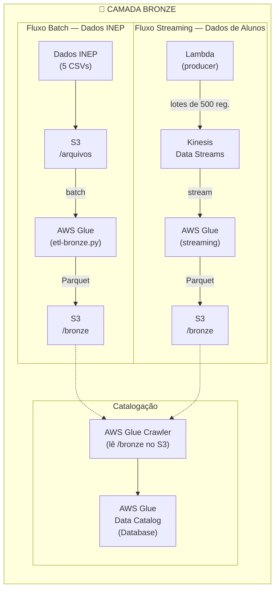
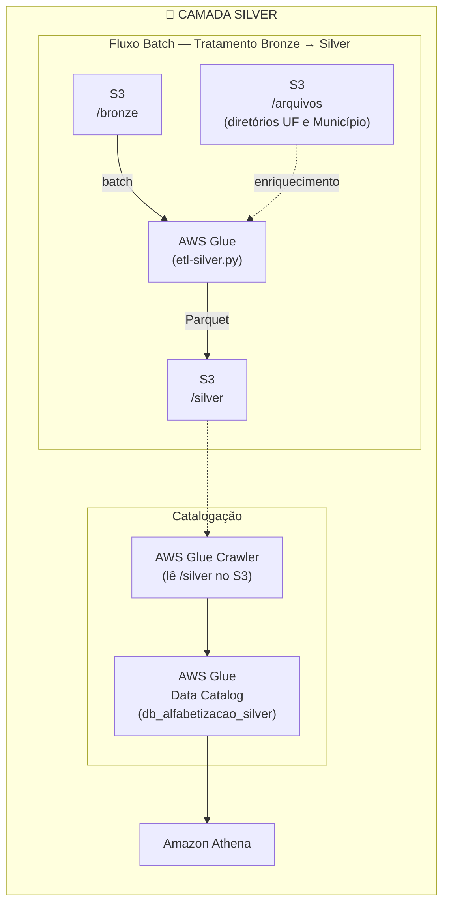

# [FIAP - Fase2] Tech Challenge: Análise de Alfabetização no Brasil


Projeto desenvolvido para o **Tech Challenge da Fase 2 da FIAP (IA Scientist)**, com o objetivo de construir uma pipeline de dados no modelo **arquitetura medalhão** (Bronze → Silver → Gold) utilizando a **AWS** como provedor de nuvem.

## 📌 Sumário
- [Objetivo do Projeto](#objetivo-do-projeto)
- [Contexto do Problema](#contexto-do-problema)
- [Descrição da base de dados](#descricao-da-base-de-dados)
- [Estrutura do Repositório](#estrutura-do-repositório)
- [Arquitetura da Solução](#arquitetura-da-solução)
  - [Arquitetura Medalhão - Camada Bronze](#arquitetura-bronze)
    - [Arquitetura AWS](#arquitetura-aws--camada-bronze)
    - [Scripts](#scripts)
    - [Estrutura de Pastas no S3](#estrutura-de-pastas-no-s3)
    - [Configuração dos Serviços AWS](#configuracao-dos-servicos-aws)
      - [Pré-requisitos — IAM Role](#pré-requisitos--iam-role)
      - [Amazon S3](#1-amazon-s3)
      - [Amazon Kinesis Data Streams](#2-amazon-kinesis-data-streams)
      - [AWS Lambda — Producer](#3-aws-lambda--producer)
      - [AWS Glue — Job Batch (ETL Bronze)](#4-aws-glue--job-batch-etl-bronze)
      - [AWS Glue — Job Streaming](#5-aws-glue--job-streaming)
      - [AWS Glue — Crawler](#6-aws-glue--crawler)
  - [Arquitetura Medalhão - Camada Silver](#arquitetura-silver)
  - [Arquitetura Medalhão - Camada Gold](#arquitetura-gold)
- [Tecnologias Utilizadas](#tecnologias-utilizadas)
- [FinOps - Otimização de Custos](#finops---otimização-de-custos)
- [Aplicação em IA](#aplicação-em-ia)
- [Principais análises realizadas](#principais-analises-realizadas)
- [Limitações](#limitacoes)
- [Próximos passos](#proximos-passos)
- [Entrega Executiva](#entrega-executiva)
- [Resumo executivo](#resumo-executivo)
- [Conclusão](#conclusao)

<a id="objetivo-do-projeto"></a>
## 🎯 Objetivo do Projeto
Construir uma pipeline escalável que realize:
- Ingestão de diferentes fontes de dados educacionais.  
- Tratamento e padronização das informações.  
- Integração entre bases heterogêneas.  
- Disponibilização de uma camada analítica confiável.  
- Monitoramento operacional do pipeline.  
- Controle de custos da infraestrutura (FinOps).  

<a id="contexto-do-problema"></a>
## 📃 Contexto do Problema
A alfabetização na infância é um dos pilares fundamentais para o desenvolvimento educacional, social e econômico de um país. O **Compromisso Nacional Criança Alfabetizada** busca garantir que todas as crianças brasileiras estejam alfabetizadas até o final do 2º ano do ensino fundamental.  

Em 2023, o **INEP** definiu o ponto de corte de **743 pontos na escala Saeb** como referência para considerar uma criança alfabetizada. A partir disso, foi criado o **Indicador Criança Alfabetizada**, que expressa o percentual de estudantes que atingem esse patamar de proficiência.  

Nosso desafio é construir uma **pipeline híbrida (Batch + Streaming)** em nuvem, seguindo a **Arquitetura Medalhão (Bronze, Silver, Gold)**, para integrar diferentes fontes de dados educacionais e apoiar políticas públicas baseadas em evidências.

<a id="descricao-da-base-de-dados"></a>
## 📝 Descrição da base de dados

Os arquivos utilizados são disponibilizados publicamente pelo [INEP](https://www.gov.br/inep/pt-br) e referem-se à **Avaliação de Alfabetização (ALFA)**:

| Arquivo CSV | Descrição | Ingestão |
|---|---|---|
| `br_inep_avaliacao_alfabetizacao_uf.csv` | Taxas e médias de alfabetização por UF | Batch |
| `br_inep_avaliacao_alfabetizacao_municipio.csv` | Taxas e médias de alfabetização por município | Batch |
| `br_inep_avaliacao_alfabetizacao_meta_alfabetizacao_brasil.csv` | Metas nacionais de alfabetização (2024–2030) | Batch |
| `br_inep_avaliacao_alfabetizacao_meta_alfabetizacao_uf.csv` | Metas de alfabetização por UF (2024–2030) | Batch |
| `br_inep_avaliacao_alfabetizacao_meta_alfabetizacao_municipio.csv` | Metas de alfabetização por município (2024–2030) | Batch |
| `br_inep_avaliacao_alfabetizacao_aluno.csv` | Dados individuais de alunos | Streaming (Kinesis) |

Os arquivos ficam armazenados no S3 sob o prefixo `s3://<BUCKET_NAME>/arquivos/`.

**Os arquivos utilizados também podem ser baixados clicando no link:** 🔗[Download base de dados](https://drive.google.com/file/d/16tnS_J9I_r2oTVbugjK_q1svYGd6tj2n/view?usp=sharing)

<a id="estrutura-do-repositório"></a>

## 📁 Estrutura do Repositório

```text
.
|-- data/
|   |-- fonte-apoio/
|       |-- br_bd_diretorios_brasil_municipio.csv
|       |-- br_bd_diretorios_brasil_uf.csv
|   |-- fonte-dados/
|       |-- br_inep_avaliacao_alfabetizacao_aluno.csv  (>200MB - Necessário baixar arquivo)
|       |-- br_inep_avaliacao_alfabetizacao_meta_alfabetizacao_brasil.csv
|       |-- br_inep_avaliacao_alfabetizacao_meta_alfabetizacao_municipio.csv
|       |-- br_inep_avaliacao_alfabetizacao_meta_alfabetizacao_uf.csv
|       |-- br_inep_avaliacao_alfabetizacao_municipio.csv
|       |-- br_inep_avaliacao_alfabetizacao_uf.csv
|-- scripts/
|   |-- deploy/
|       |-- deploy.sh        (automação da pipeline via AWS CLI)
|       |-- README.md        (como usar o deploy.sh)
|-- src/
|   |-- bronze/
|       |-- etl-bronze.py
|       |-- producer-student-data.py
|       |-- glue-streaming-job.py
|   |-- silver/
|       |-- etl-silver.py
`-- README.md
```
🔗[Download base de dados](https://drive.google.com/file/d/16tnS_J9I_r2oTVbugjK_q1svYGd6tj2n/view?usp=sharing)

<a id="arquitetura-da-solução"></a>
## 🏗️ Arquitetura da Solução

<a id="arquitetura-bronze"></a>
### 🥉 Arquitetura Medalhão — Camada Bronze 

<a id="arquitetura-aws--camada-bronze"></a>
### Arquitetura AWS 
---



<a id="scripts"></a>
### Scripts
---

### [`src/bronze/etl-bronze.py`](src/bronze/etl-bronze.py) — AWS Glue Job (Batch)

Job do **AWS Glue** responsável por ler os 5 arquivos CSV do INEP armazenados no S3, aplicar schema enforcement e gravar os dados em formato **Parquet** particionado por `ano` na camada Bronze.

**O que faz:**
- Recebe o nome do bucket via parâmetro de job `--BUCKET_NAME`
- Lê cada CSV com schema explícito via PySpark, tratando valores nulos e vazios com `nullValue` / `emptyValue`
- Adiciona colunas de auditoria: `_ingestion_date`, `_ingestion_timestamp`, `_source_path`, `_source_entity`
- Salva em Parquet com `partitionBy("ano")` e `mode("overwrite")`
- Destino: `s3://<BUCKET_NAME>/bronze/<nome_entidade>/ano=XXXX/`

**Entidades processadas:**

| Entidade (pasta Bronze) | Arquivo de origem |
|---|---|
| `avaliacao_alfabetizacao_uf` | `br_inep_avaliacao_alfabetizacao_uf.csv` |
| `avaliacao_alfabetizacao_municipio` | `br_inep_avaliacao_alfabetizacao_municipio.csv` |
| `avaliacao_alfabetizacao_meta_alfabetizacao_brasil` | `br_inep_avaliacao_alfabetizacao_meta_alfabetizacao_brasil.csv` |
| `avaliacao_alfabetizacao_meta_alfabetizacao_uf` | `br_inep_avaliacao_alfabetizacao_meta_alfabetizacao_uf.csv` |
| `avaliacao_alfabetizacao_meta_alfabetizacao_municipio` | `br_inep_avaliacao_alfabetizacao_meta_alfabetizacao_municipio.csv` |


### [`src/bronze/producer-student-data.py`](src/bronze/producer-student-data.py) — AWS Lambda (Producer Kinesis)

Função **AWS Lambda** que simula a chegada gradual de dados de alunos, lendo o arquivo `br_inep_avaliacao_alfabetizacao_aluno.csv` do S3 e enviando os registros em lotes para o **Amazon Kinesis Data Streams**.

**O que faz:**
- Lê configuração via **variáveis de ambiente** (`BUCKET_NAME`, `CSV_PATH`, `AWS_REGION`)
- Faz download do CSV do S3 para `/tmp/aluno.csv`
- Envia registros em lotes de 500 para o stream `stream-alfabetizacao-aluno`
- Usa `id_aluno` como partition key do Kinesis (fallback: `"default"`)
- Aguarda 0.3s entre lotes para simular chegada gradual de dados

### [`src/bronze/glue-streaming-job.py`](src/bronze/glue-streaming-job.py) — AWS Glue Streaming Job

Job do **AWS Glue** em modo streaming que consome os registros do **Amazon Kinesis**, aplica transformações e persiste na camada Bronze.

**O que faz:**
- Recebe `--BUCKET_NAME` e `--REGION` como parâmetros de job
- Lê do Kinesis (`TRIM_HORIZON`) com trigger de **30 segundos**
- Deserializa o payload JSON recebido no campo `data` (binário → string → JSON)
- Trata colunas numéricas que podem chegar vazias: `preenchimento_caderno`, `alfabetizado`, `proficiencia`, `peso_aluno`
- Adiciona colunas de auditoria: `_ingestion_date`, `_ingestion_timestamp`, `_source_entity`
- Salva em Parquet com `partitionBy("ano")` e `mode("append")`
- Checkpoint no S3 para resiliência: `s3://<BUCKET_NAME>/checkpoints/avaliacao_alfabetizacao_aluno/`

<a id="estrutura-de-pastas-no-s3"></a>
### Estrutura de Pastas no S3
---

```
s3://<BUCKET_NAME>/
├── arquivos/
│   ├── br_inep_avaliacao_alfabetizacao_uf.csv
│   ├── br_inep_avaliacao_alfabetizacao_municipio.csv
│   ├── br_inep_avaliacao_alfabetizacao_meta_alfabetizacao_brasil.csv
│   ├── br_inep_avaliacao_alfabetizacao_meta_alfabetizacao_uf.csv
│   ├── br_inep_avaliacao_alfabetizacao_meta_alfabetizacao_municipio.csv
│   └── br_inep_avaliacao_alfabetizacao_aluno.csv
│
├── bronze/
│   ├── avaliacao_alfabetizacao_uf/ano=XXXX/
│   ├── avaliacao_alfabetizacao_municipio/ano=XXXX/
│   ├── avaliacao_alfabetizacao_meta_alfabetizacao_brasil/ano=XXXX/
│   ├── avaliacao_alfabetizacao_meta_alfabetizacao_uf/ano=XXXX/
│   ├── avaliacao_alfabetizacao_meta_alfabetizacao_municipio/ano=XXXX/
│   └── avaliacao_alfabetizacao_aluno/ano=XXXX/
│
├── checkpoints/
│   └── avaliacao_alfabetizacao_aluno/
│
└── scripts/
    ├── etl-bronze.py
    ├── glue-streaming-job.py
    └── producer-student-data.py
```

<a id="configuracao-dos-servicos-aws"></a>
### Configuração dos Serviços AWS
---

> **Região utilizada:** `us-east-1`

Há **duas formas** de provisionar e executar a pipeline:

| Forma | Quando usar | Onde |
|---|---|---|
| 🤖 **Automatizada (AWS CLI)** | Subir tudo de forma reproduzível por linha de comando | [`scripts/deploy/`](scripts/deploy/README.md) — script `deploy.sh` idempotente |
| 🖱️ **Manual (Console web)** | Entender e configurar serviço por serviço | As subseções abaixo |

As subseções a seguir descrevem a configuração **manual no console**, que também serve de referência para os valores usados pelo script.

<a id="pré-requisitos--iam-role"></a>
### Pré-requisitos — IAM Role
---

Todos os serviços abaixo compartilham a mesma role(`LabRole`) com as seguintes permissões:

| Política | Finalidade |
|---|---|
| `AmazonS3FullAccess` | Leitura e escrita no bucket |
| `AWSGlueServiceRole` | Execução dos jobs e crawlers do Glue |
| `AmazonKinesisFullAccess` | Leitura/escrita no Data Stream |
| `AWSLambdaBasicExecutionRole` | Logs da Lambda no CloudWatch |

> No ambiente **AWS Academy / Learner Lab**, use a role `LabRole` já existente.

<a id="1-amazon-s3"></a>
### 1. Amazon S3
---

**Console → S3 → Create bucket**

| Campo | Valor |
|---|---|
| Bucket name | `<seu-bucket-name>` (ex: `fiap-tech-challenge-2-<account-id>-us-east-1`) |
| Region | `us-east-1` |
| Block public access | Mantido ativado (padrão) |

Após criar o bucket, faça upload dos arquivos CSV do INEP para o prefixo `arquivos/` e dos scripts `.py` para `scripts/`.

<a id="2-amazon-kinesis-data-streams"></a>
### 2. Amazon Kinesis Data Streams
---

**Console → Kinesis → Data Streams → Create data stream**

| Campo | Valor |
|---|---|
| Data stream name | `stream-alfabetizacao-aluno` |
| Capacity mode | **On-demand** (recomendado para o volume do INEP) |
| Region | `us-east-1` |

> O nome do stream está fixo nos scripts (`STREAM_NAME = "stream-alfabetizacao-aluno"`). Caso altere, atualize todos os três arquivos.

<a id="3-aws-lambda--producer"></a>
### 3. AWS Lambda — Producer
---

**Console → Lambda → Create function**

#### Criação

| Campo | Valor |
|---|---|
| Function name | `producer-student-data` |
| Runtime | `Python 3.12` |
| Architecture | `x86_64` |
| Execution role | `LabRole` |

#### Código

Copie o conteúdo de `src/bronze/producer-student-data.py` diretamente no editor inline ou faça upload como arquivo `.zip`.

#### Variáveis de ambiente

**Configuration → Environment variables → Edit → Add environment variable**

| Chave | Valor |
|---|---|
| `BUCKET_NAME` | `<seu-bucket-name>` |
| `CSV_PATH` | `arquivos/br_inep_avaliacao_alfabetizacao_aluno.csv` |
| `AWS_REGION` | `us-east-1` |

> `AWS_REGION` é injetada automaticamente pelo Lambda. Defini-la explicitamente garante consistência com o cliente boto3.

#### Timeout e memória

O arquivo de alunos é grande. Ajuste em **Configuration → General configuration**:

| Campo | Valor recomendado |
|---|---|
| Timeout | `15 min` (máximo do Lambda) |
| Memory | `512 MB` |
| Ephemeral storage (/tmp) | `1024 MB` (ou mais, conforme tamanho do CSV) |

<a id="4-aws-glue--job-batch-etl-bronze"></a>
### 4. AWS Glue — Job Batch (ETL Bronze)
---

**Console → AWS Glue → ETL Jobs → Script editor → Create new script**

#### Criação

| Campo | Valor |
|---|---|
| Job name | `etl-bronze-alfabetizacao` |
| IAM Role | `LabRole` |
| Type | `Spark` |
| Glue version | `Glue 4.0` |
| Language | `Python 3` |
| Script path (S3) | `s3://<seu-bucket>/scripts/etl-bronze.py` |
| Temporary directory | `s3://<seu-bucket>/tmp/` |

#### Parâmetros do Job

**Job details → Advanced properties → Job parameters → Add new parameter**

| Chave | Valor |
|---|---|
| `--BUCKET_NAME` | `<seu-bucket-name>` |

#### Executar

Clique em **Run** no canto superior direito. Acompanhe os logs em **CloudWatch → Log groups → /aws-glue/jobs/output**.

<a id="5-aws-glue--job-streaming"></a>
### 5. AWS Glue — Job Streaming
---

**Console → AWS Glue → ETL Jobs → Script editor → Create new script**

#### Criação

| Campo | Valor |
|---|---|
| Job name | `glue-streaming-alfabetizacao-aluno` |
| IAM Role | `LabRole` |
| Type | `Spark Streaming` |
| Glue version | `Glue 4.0` |
| Language | `Python 3` |
| Script path (S3) | `s3://<seu-bucket>/scripts/glue-streaming-job.py` |
| Temporary directory | `s3://<seu-bucket>/tmp/` |

#### Parâmetros do Job

| Chave | Valor |
|---|---|
| `--BUCKET_NAME` | `<seu-bucket-name>` |
| `--REGION` | `us-east-1` |

> **Checkpoint:** em caso de falha ou necessidade de reprocessar desde o início, apague a pasta `s3://<seu-bucket>/checkpoints/avaliacao_alfabetizacao_aluno/` antes de iniciar o job novamente.

#### Ordem de execução

1. Inicie o **Glue Streaming Job** primeiro (ele ficará aguardando mensagens)
2. Execute a **Lambda** em seguida para começar a produzir dados no Kinesis (Botão Testar)

<a id="6-aws-glue--crawler"></a>
### 6. AWS Glue — Crawler
---

O Crawler cataloga automaticamente as pastas Parquet do S3 como tabelas no **AWS Glue Data Catalog**, tornando os dados consultáveis via **Amazon Athena**.

**Console → AWS Glue → Crawlers → Create crawler**

#### Passo 1 — Set crawler properties

| Campo | Valor |
|---|---|
| Crawler name | `crawler-bronze-alfabetizacao` |

#### Passo 2 — Choose data sources

| Campo | Valor |
|---|---|
| Data source | S3 |
| S3 path | `s3://<seu-bucket>/bronze/` |
| Subsequent crawler runs | `Crawl all sub-folders` |

#### Passo 3 — Configure security settings

| Campo | Valor |
|---|---|
| IAM Role | `LabRole` |

#### Passo 4 — Set output and scheduling

| Campo | Valor |
|---|---|
| Target database | Crie um novo: `db_alfabetizacao_bronze` |
| Table name prefix | `bronze_` *(opcional)* |
| Crawler schedule | `On demand` (execução manual) |

#### Passo 5 — Review e Create

Após criado, clique em **Run crawler**. Ao concluir, as tabelas estarão disponíveis no banco `db_alfabetizacao_bronze` e poderão ser consultadas diretamente no **Amazon Athena**.

#### Verificar no Athena

```sql
-- Listar tabelas catalogadas
SHOW TABLES IN db_alfabetizacao_bronze;

-- Exemplo de consulta
-- Obs.: a tabela tem uma linha por (sigla_uf, serie, rede); na Bronze a coluna
-- `rede` é o código de origem do INEP (0, 2, 3, 5). A decodificação para texto
-- (rede_nome) é feita na camada Silver.
-- Obs.: `ano` é coluna de partição (texto no catálogo) — filtre com aspas: '2023'.
SELECT ano, sigla_uf, rede, taxa_alfabetizacao, media_portugues
FROM db_alfabetizacao_bronze.bronze_avaliacao_alfabetizacao_uf
WHERE ano = '2023'
ORDER BY taxa_alfabetizacao DESC
LIMIT 10;
```

<a id="arquitetura-silver"></a>
### 🥈 Arquitetura Medalhão — Camada Silver

A camada **Silver** consome os dados Parquet da Bronze, aplica limpeza, padronização, tipagem, deduplicação e enriquecimento dimensional simples, e grava o resultado em Parquet particionado por `ano`.



#### Script — [`src/silver/etl-silver.py`](src/silver/etl-silver.py) — AWS Glue Job (Batch)

Job do **AWS Glue** que consome as entidades da camada Bronze, aplica limpeza, padronização, tipagem, decodificação de domínios, deduplicação e enriquecimento dimensional, e grava os dados em formato **Parquet** particionado por `ano` na camada Silver. O processamento é reutilizável e orientado por configuração (uma entrada por entidade).

**O que faz:**
- Recebe o nome do bucket via parâmetro de job `--BUCKET_NAME`
- Lê cada entidade da Bronze em `s3://<BUCKET_NAME>/bronze/<entidade>/` (Parquet)
- Padroniza nomes de colunas (`snake_case`, sem acentos/espaços), preservando colunas técnicas
- Converte strings vazias em `NULL` e remove espaços extras (`trim`)
- Corrige tipos: `ano`/`nivel_alfabetizacao` → inteiro; taxas, médias, proporções, metas e percentuais → `double`; ids e códigos → `string` (preserva zeros à esquerda)
- Decodifica os domínios `rede`/`serie` em `rede_nome`/`serie_nome`, preservando o código original
- Deduplica pela chave de negócio da entidade (com log da diferença de volume)
- Enriquece com as dimensões de apoio (UF e Município): `sigla_uf`, `nome_municipio`, `nome_uf`, `nome_regiao`
- Adiciona colunas de auditoria: `_silver_processing_date`, `_silver_processing_timestamp`, `_silver_source_entity`, `_source_layer`, `_pipeline_stage`
- Salva em Parquet com `partitionBy("ano")` e `mode("overwrite")`
- Destino: `s3://<BUCKET_NAME>/silver/<entidade>/ano=XXXX/`

**Entidades processadas:**

| Entidade (pasta Silver) | Chave de deduplicação | Enriquecimento |
|---|---|---|
| `avaliacao_alfabetizacao_uf` | `ano, sigla_uf, serie, rede` | UF (`nome_uf`, `nome_regiao`) |
| `avaliacao_alfabetizacao_municipio` | `ano, id_municipio, serie, rede` | Município (`sigla_uf`, `nome_municipio`, `nome_uf`, `nome_regiao`) |
| `avaliacao_alfabetizacao_meta_alfabetizacao_brasil` | `ano, rede` | — |
| `avaliacao_alfabetizacao_meta_alfabetizacao_uf` | `ano, sigla_uf, rede` | UF |
| `avaliacao_alfabetizacao_meta_alfabetizacao_municipio` | `ano, id_municipio, rede` | Município |
| `avaliacao_alfabetizacao_aluno` | `ano, id_aluno, id_escola` | Município |

#### Características das fontes de dados

Características das entidades que orientam o contrato de transformação da Silver:

| Tabela | Linhas | Chaves duplicadas | Cobertura do join (apoio) | Observações |
|---|---|---|---|---|
| `uf` | 145 | 0 | 25/25 UFs | `serie` constante (`2`); `rede` ∈ {0,2,3,5} |
| `municipio` | 23.995 | 0 | 5.550/5.550 municípios | sem `sigla_uf` na origem → adicionada via apoio |
| `meta_uf` | 54 | 0 | 27/27 UFs | `rede` = `Pública`; nulos em `taxa` (7,4%) |
| `meta_municipio` | 10.704 | 0 | 5.352/5.352 municípios | `rede` = `Municipal`; `nivel_alfabetizacao` ∈ {0–5} |
| `meta_brasil` | 3 | 0 | n/a | metas nacionais 2024–2030 |
| `aluno` | 3.867.999 | 0 | 5.548/5.548 municípios | `serie`=`2`; `rede` ∈ {2,3,4}; `presenca`/`alfabetizado` ∈ {0,1} |
| `dim_uf` / `dim_municipio` | 27 / 5.571 | chaves únicas | — | `id_municipio` sempre com 7 dígitos |

Tratamentos correspondentes na Silver:

- A deduplicação preserva todos os registros: as chaves de negócio são íntegras nas fontes.
- O enriquecimento dimensional tem **cobertura total** (sem registros órfãos).
- `id_municipio` é mantido como `string` de 7 dígitos.
- Os nulos de `proporcao_aluno_nivel_*` (~48%) representam ausência legítima de informação e são preservados.
- No `aluno`, `proficiencia` e `peso_aluno` são nulos apenas para alunos ausentes (`presenca=0`, ~13%); `alfabetizado` e `presenca` são tipados como inteiro (indicadores 0/1).
- Os arquivos de origem estão em **UTF-8**.

#### Decodificação de domínios (`rede` e `serie`)

A Silver decodifica os códigos do INEP em rótulos legíveis (`rede_nome`, `serie_nome`), **preservando sempre o código original** para rastreabilidade. As tabelas de referência são mantidas no próprio script (`REDE_MAP` / `SERIE_MAP`).

**Dicionário oficial aplicado:**

| `rede` | `rede_nome` |
|---|---|
| 0 | Total (Federal, Estadual, Municipal e Privada) |
| 1 | Federal |
| 2 | Estadual |
| 3 | Municipal |
| 4 | Privada |
| 5 | Pública (Estadual e Municipal) |
| 6 | Pública (Federal, Estadual e Municipal) |

| `serie` | `serie_nome` |
|---|---|
| 2 | 2º ano do Ensino Fundamental |

> ⚠️ **Observação:** nas tabelas de **avaliação** `rede` chega como **código** (decodificado acima); nas tabelas de **meta** `rede` já vem como **texto** (`Pública`, `Municipal`) e é **preservado como está** (o valor textual não consta no de-para e o `COALESCE` mantém a origem). A conversão inversa (texto → código) não é aplicada nesta camada, pois `Pública` na meta não corresponde de forma única ao código `5` (Estadual e Municipal) ou `6` (Federal, Estadual e Municipal). Essa harmonização cabe à camada Gold.

#### Estrutura de pastas no S3 — Silver

```text
s3://<BUCKET_NAME>/silver/
├── avaliacao_alfabetizacao_uf/ano=XXXX/
├── avaliacao_alfabetizacao_municipio/ano=XXXX/
├── avaliacao_alfabetizacao_meta_alfabetizacao_brasil/ano=XXXX/
├── avaliacao_alfabetizacao_meta_alfabetizacao_uf/ano=XXXX/
├── avaliacao_alfabetizacao_meta_alfabetizacao_municipio/ano=XXXX/
└── avaliacao_alfabetizacao_aluno/ano=XXXX/
```

#### AWS Glue — Job Silver

**Console → AWS Glue → ETL Jobs → Script editor → Create new script**

| Campo | Valor |
|---|---|
| Job name | `etl-silver-alfabetizacao` |
| IAM Role | `LabRole` |
| Type | `Spark` |
| Glue version | `Glue 4.0` |
| Language | `Python 3` |
| Script path (S3) | `s3://<seu-bucket>/scripts/etl-silver.py` |
| Temporary directory | `s3://<seu-bucket>/tmp/` |
| Job parameter | `--BUCKET_NAME` = `<seu-bucket-name>` |

> Ordem de execução: rode o **ETL Bronze** (e o streaming de alunos, se aplicável) **antes** do ETL Silver, pois a Silver lê de `/bronze/`.

#### AWS Glue — Crawler Silver

| Campo | Valor |
|---|---|
| Crawler name | `crawler-silver-alfabetizacao` |
| S3 path | `s3://<seu-bucket>/silver/` |
| Subsequent runs | `Crawl all sub-folders` |
| IAM Role | `LabRole` |
| Target database | `db_alfabetizacao_silver` |
| Table name prefix | `silver_` |
| Schedule | `On demand` |

#### Verificar no Athena

```sql
-- Listar tabelas catalogadas
SHOW TABLES IN db_alfabetizacao_silver;

-- Amostra com colunas enriquecidas
-- Obs.: `ano` é coluna de partição e o crawler a cataloga como texto (varchar),
-- por isso o filtro usa aspas: ano = '2023' (e não ano = 2023).
SELECT ano, sigla_uf, nome_uf, nome_regiao, taxa_alfabetizacao
FROM db_alfabetizacao_silver.silver_avaliacao_alfabetizacao_uf
WHERE ano = '2023'
ORDER BY taxa_alfabetizacao DESC;

-- Conferir nulos em coluna crítica
SELECT count(*) AS total,
       count_if(taxa_alfabetizacao IS NULL) AS taxa_nula
FROM db_alfabetizacao_silver.silver_avaliacao_alfabetizacao_municipio;

-- Conferir duplicidade na chave de negócio
SELECT ano, id_municipio, serie, rede, count(*) AS qtd
FROM db_alfabetizacao_silver.silver_avaliacao_alfabetizacao_municipio
GROUP BY ano, id_municipio, serie, rede
HAVING count(*) > 1;

-- Validar a decodificação de domínio (código de origem x rótulo)
SELECT DISTINCT rede, rede_nome, serie, serie_nome
FROM db_alfabetizacao_silver.silver_avaliacao_alfabetizacao_uf
ORDER BY rede;
```

<a id="arquitetura-gold"></a>
### 🥇 Arquitetura Medalhão — Camada Gold 

Em construção 🚧


<a id="tecnologias-utilizadas"></a>
## 🛠️ Tecnologias Utilizadas

| Serviço / Tecnologia | Uso |
|---|---|
| **Amazon S3** | Armazenamento dos CSVs de origem, camada Bronze (Parquet), scripts e checkpoints |
| **AWS Glue (PySpark)** | Ingestão batch e streaming (Bronze) e tratamento/padronização (Silver) |
| **Amazon Kinesis Data Streams** | Ingestão dos dados de alunos em tempo real |
| **AWS Lambda** | Producer que lê o CSV do S3 e envia registros ao Kinesis |
| **AWS Glue Crawler** | Catalogação automática das tabelas Parquet no Glue Data Catalog |
| **AWS Glue Data Catalog** | Metastore centralizado para consultas via Athena |
| **Amazon Athena** | Consultas SQL sobre as camadas Bronze e Silver |
| **Apache Parquet** | Formato de armazenamento colunar nas camadas Bronze e Silver |
| **Python 3** | Linguagem dos scripts |

<a id="finops---otimização-de-custos"></a>
## 📉 FinOps - Otimização de Custos

Em construção 🚧


<a id="aplicação-em-ia"></a>
## 🤖 Aplicação em IA

Em construção 🚧

<a id="principais-analises-realizadas"></a>
## 📊 Principais análises realizadas

Em construção 🚧

<a id="limitacoes"></a>
## ❗ Limitações

Em construção 🚧

<a id="proximos-passos"></a>
## 🔎 Próximos passos

- [✅] Camada **Bronze** — ingestão e armazenamento dos dados brutos do INEP no Amazon S3 em formato Parquet
- [✅] Camada **Silver** — limpeza, padronização, joins e enriquecimento dos dados
- [ ] Camada **Gold** — agregações e métricas para análise de alfabetização
- [ ] Dashboard / relatório com os resultados da análise

<a id="entrega-executiva"></a>
## 🎥 Entrega Executiva

Este projeto também inclui materiais voltados para stakeholders e lideranças, focados em tomada de decisão:

* **[Slides de Apresentação](#.pptx):** Material visual com o contexto do problema, arquitetura da solução, valor da pipeline para análises educacionais e potencial uso para inteligência artificial (Em construção 🚧)

<a id="resumo-executivo"></a>
## 💼 Resumo executivo

Em construção 🚧

<a id="conclusao"></a>
## 🚀 Conclusão

Em construção 🚧