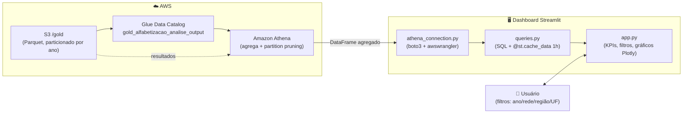

# 📚 Dashboard Executivo — Alfabetização no Brasil

Aplicação web em **Streamlit** que transforma a camada **Gold** da pipeline
(`db_alfabetizacao_gold.gold_alfabetizacao_analise_output`) em um painel
analítico interativo sobre o **Indicador Criança Alfabetizada** do INEP. É a
camada de **consumo** da arquitetura medalhão: fecha o ciclo
Bronze → Silver → Gold → **visualização**, entregando a leitura de negócio ao
usuário final (gestor público, pesquisador, avaliador).

O dashboard consome a Gold **diretamente via Amazon Athena**, com todas as
agregações executadas no próprio Athena (com *partition pruning* pela partição
`ano`) e resultados em cache — o Streamlit recebe apenas o dado já agregado.

---

## 📌 Sumário

- [Objetivo](#objetivo)
- [Perguntas que o dashboard responde](#perguntas-que-o-dashboard-responde)
- [Tecnologias utilizadas](#tecnologias-utilizadas)
- [Arquitetura e fluxo de dados](#arquitetura-e-fluxo-de-dados)
- [Estrutura do código](#estrutura-do-codigo)
- [Seções do dashboard](#secoes-do-dashboard)
- [Pré-requisitos](#pre-requisitos)
- [Instalação](#instalacao)
- [Configuração (variáveis de ambiente)](#configuracao)
- [Execução](#execucao)
- [Decisões de projeto](#decisoes-de-projeto)
- [Custo e performance](#custo-e-performance)
- [Solução de problemas](#solucao-de-problemas)

---

<a id="objetivo"></a>
## 🎯 Objetivo

Dar **visibilidade executiva** ao avanço da alfabetização no Brasil e apoiar
**políticas públicas baseadas em evidências**. Em vez de exigir consultas SQL
manuais sobre a camada Gold, o painel permite que qualquer pessoa:

- acompanhe a **taxa nacional oficial** do INEP frente à **meta pactuada** do
  Compromisso Nacional Criança Alfabetizada;
- compare **UFs, regiões e municípios** e identifique desigualdades territoriais;
- descubra **quais municípios estão abaixo da meta** e devem ser priorizados;
- separe, quando há microdados de aluno, um problema de **participação**
  (crianças que faltaram à prova → busca ativa) de um problema de
  **aprendizagem** (crianças presentes e não alfabetizadas → reforço pedagógico).

O grão da análise é **ano × município × rede**, focado no **2º ano do Ensino
Fundamental** — série de referência do indicador. O corte de **743 pontos na
escala Saeb** é o limiar oficial do INEP para considerar uma criança
alfabetizada.

<a id="perguntas-que-o-dashboard-responde"></a>
## ❓ Perguntas que o dashboard responde

| Pergunta de negócio | Onde no painel |
|---|---|
| O Brasil está cumprindo a meta nacional? Melhorou frente ao ano anterior? | KPIs + gráfico *Brasil: realizado × meta* |
| Quais UFs lideram e quais ficam para trás? Atingiram a meta estadual? | Ranking das UFs (colorido por status) |
| Como os municípios se distribuem ao longo da escala de alfabetização? | Histograma *Distribuição por taxa* |
| Em cada região, quantos municípios atingiram / ficaram abaixo da meta? | Barras 100% empilhadas *Atingimento por região* |
| Quais os municípios de maior e menor desempenho no recorte? | Destaques municipais (top/bottom 10) |
| O município falha por baixa presença ou por baixa aprendizagem? | Dispersão *presença × aprendizagem* + diagnóstico |
| Qual o dado município a município, com exportação? | Tabela detalhada + download CSV |

<a id="tecnologias-utilizadas"></a>
## 🛠️ Tecnologias utilizadas

| Tecnologia | Papel no dashboard |
|---|---|
| **[Streamlit](https://streamlit.io/)** (`>=1.36`) | Framework da aplicação web: layout, sidebar de filtros, KPIs (`st.metric`), tabela interativa, botão de download e **cache de dados** (`@st.cache_data`) |
| **[Amazon Athena](https://aws.amazon.com/athena/)** | Motor de consulta *serverless* (SQL Presto/Trino) que agrega a camada Gold sobre o Parquet no S3 — sem servidor de banco para manter |
| **[AWS SDK for pandas / awswrangler](https://aws-sdk-pandas.readthedocs.io/)** (`>=3.9`) | Ponte Athena → `pandas`: executa as queries e devolve `DataFrame` (`wr.athena.read_sql_query`, `ctas_approach=False`) |
| **[boto3](https://boto3.amazonaws.com/)** (`>=1.34`) | Sessão AWS / credenciais para o awswrangler falar com o Athena |
| **[pandas](https://pandas.pydata.org/)** (`>=2.0`) | Manipulação leve dos resultados agregados (formatação, percentuais, cálculos derivados dos KPIs) |
| **[Plotly](https://plotly.com/python/)** (`>=5.22`) | Gráficos interativos (`graph_objects`): linhas, barras horizontais/empilhadas, histograma e dispersão WebGL |
| **AWS Glue Data Catalog** | Metadados da tabela Gold consultados pelo Athena (inclusive as partições `ano`) |
| **Amazon S3 (Parquet)** | Armazenamento colunar da camada Gold consultada; também guarda os resultados das consultas do Athena |

> **Linguagem:** Python 3. **Padrão de UI:** aplicação de página única (*single-page*) responsiva (`layout="wide"`).

<a id="arquitetura-e-fluxo-de-dados"></a>
## 🏗️ Arquitetura e fluxo de dados

O dashboard **não relê CSV nem as camadas anteriores**: consome exclusivamente a
tabela Gold catalogada, mantendo a regra de negócio (metas, status de
atingimento, harmonização de redes) no ETL e deixando a aplicação apenas com a
apresentação.



**Como uma interação acontece:**

1. O usuário escolhe **ano, rede, região e UF** na sidebar.
2. `app.py` chama funções de `queries.py`, que montam o SQL do recorte.
3. Cada consulta **filtra a partição `ano`** e **agrega no Athena** — o resultado
   já vem pronto para o gráfico.
4. `@st.cache_data(ttl=3600)` guarda o resultado por 1 hora: trocar para um
   filtro já consultado **não** reconsulta o Athena.
5. Plotly renderiza; `st.metric` mostra os KPIs; a tabela permite busca e
   exportação em CSV.

<a id="estrutura-do-codigo"></a>
## 📁 Estrutura do código

| Arquivo | Papel |
|---|---|
| [`app.py`](app.py) | **Camada de apresentação.** Configura a página, monta a sidebar de filtros, os 4 KPIs nacionais, o gráfico Brasil × meta, o ranking de UFs, o histograma, o atingimento por região, os destaques municipais, a seção condicional de *presença × aprendizagem* e a tabela detalhada com download. Concentra também as constantes visuais (paleta, formatação pt-BR, *chrome* dos gráficos). |
| [`queries.py`](queries.py) | **Camada de dados.** Todas as consultas SQL, uma função por pergunta analítica, cada uma documentada com seu objetivo e decorada com `@st.cache_data(ttl=3600)`. Inclui o helper `_filtro_territorio` (cláusulas opcionais de região/UF) e a checagem `q_colunas_gold` que habilita dinamicamente a seção de aluno. |
| [`athena_connection.py`](athena_connection.py) | **Conexão única com o Athena.** Lê a configuração de variáveis de ambiente, cria a sessão boto3, executa as queries via awswrangler (`run_query`), faz *logging* estruturado, expõe `sql_literal` (escape de literais SQL) e a constante `GOLD_TABLE`. Erros viram `AthenaQueryError` com mensagem acionável. |
| [`requirements.txt`](requirements.txt) | Dependências: `streamlit`, `awswrangler`, `pandas`, `plotly`, `boto3`. |

<a id="secoes-do-dashboard"></a>
## 📊 Seções do dashboard

- **Filtros (sidebar)** — ano da avaliação, rede de ensino (padrão: Municipal,
  código `3`, que é a referência da meta municipal), região e UF. Os filtros
  alimentam a partição `ano` e as cláusulas territoriais das consultas.
- **KPIs nacionais** — taxa nacional oficial (com variação em p.p. vs. o ano
  anterior), meta nacional do ano, nº de municípios no recorte e % de municípios
  que atingiram a meta.
- **Brasil: realizado × meta** — série anual da taxa oficial contra a meta
  pactuada.
- **Ranking das UFs** — barras horizontais por taxa, coloridas pelo status da
  meta estadual (Atingida / Abaixo / Sem meta / Sem dado).
- **Distribuição dos municípios por taxa** — histograma em faixas de 5 p.p., com
  linha de referência da meta nacional.
- **Atingimento da meta por região** — barras 100% empilhadas do status por região.
- **Destaques municipais** — top 10 e bottom 10 municípios do recorte (os
  menores são candidatos naturais à priorização de política pública).
- **Presença × aprendizagem** *(condicional)* — só aparece se a Gold foi gerada
  com o fluxo de **streaming** de microdados de aluno. Traz KPIs de presença,
  taxa observada e proficiência média (Saeb), uma dispersão município a município
  e um diagnóstico que separa *problema de participação* de *problema de
  aprendizagem*.
- **Tabela detalhada** — dado município a município com busca por nome, limite de
  5.000 linhas e **exportação em CSV** (UTF-8 com BOM, pronto para Excel).

> A seção de aluno se autoconfigura: `q_colunas_gold()` inspeciona o
> `information_schema` e só habilita a análise quando as colunas de microdados
> existem na tabela — evita quebrar caso a pipeline tenha rodado só o fluxo batch.

<a id="pre-requisitos"></a>
## ✅ Pré-requisitos

1. **Pipeline executada até a Gold** e crawler `crawler-gold-alfabetizacao`
   concluído — a tabela `gold_alfabetizacao_analise_output` deve aparecer no
   Athena (ver [README da raiz](../README.md)).
2. **Credenciais AWS válidas** na máquina. No **AWS Academy / Learner Lab**,
   copie as credenciais da sessão para `~/.aws/credentials` **ou** exporte
   `AWS_ACCESS_KEY_ID`, `AWS_SECRET_ACCESS_KEY` e `AWS_SESSION_TOKEN`.
   > ⚠️ **Nunca** grave credenciais em arquivos do repositório.
3. **Python 3** instalado. Valide o acesso com `aws sts get-caller-identity`.

<a id="instalacao"></a>
## 📦 Instalação

```bash
pip install -r dashboard/requirements.txt
```

<a id="configuracao"></a>
## ⚙️ Configuração (variáveis de ambiente)

| Variável | Padrão | Descrição |
|---|---|---|
| `ATHENA_REGION` | `us-east-1` | Região AWS |
| `ATHENA_DATABASE` | `db_alfabetizacao_gold` | Database no Glue Data Catalog |
| `ATHENA_WORKGROUP` | `primary` | Workgroup do Athena |
| `ATHENA_S3_OUTPUT` | *(vazio)* | `s3://<bucket>/athena-results/` para os resultados das consultas. Se vazio, o awswrangler usa/cria o bucket padrão `aws-athena-query-results-<conta>-<região>` |

Exemplo (bash):

```bash
export ATHENA_S3_OUTPUT="s3://<seu-bucket>/athena-results/"
```

Exemplo (PowerShell):

```powershell
$env:ATHENA_S3_OUTPUT = "s3://<seu-bucket>/athena-results/"
```

<a id="execucao"></a>
## ▶️ Execução

```bash
streamlit run dashboard/app.py
```

O Streamlit abre em `http://localhost:8501`. Ajuste os filtros na sidebar; a
primeira consulta de cada recorte vai ao Athena e as seguintes vêm do cache.

<a id="decisoes-de-projeto"></a>
## 🧭 Decisões de projeto

- **Agregar no Athena, não no cliente.** Toda contagem, média e ranking é feita
  em SQL; o Streamlit recebe dezenas de linhas, não milhões. Escala e barateia.
- **Regra de negócio fica no ETL.** Metas, status de atingimento e harmonização
  de redes vêm prontos da Gold; a aplicação só apresenta — evita divergência
  entre o que o dashboard mostra e o que a camada analítica registra.
- **`ctas_approach=False`.** Leitura direta do CSV de resultado do Athena;
  adequado aos volumes agregados e sem criar tabelas temporárias no Glue.
- **Seção de aluno condicional.** O painel se adapta ao schema real da Gold,
  funcionando tanto na pipeline só-batch quanto na completa (batch + streaming).
- **Formatação pt-BR.** Percentuais com vírgula decimal e milhar com ponto
  (`62,8%`, `5.448`), coerentes com o público brasileiro.

<a id="custo-e-performance"></a>
## 💰 Custo e performance

- Toda consulta filtra a partição `ano` (**partition pruning**) e agrega **no
  Athena** — o Streamlit recebe apenas o resultado agregado.
- Consultas são cacheadas por **1 hora** (`@st.cache_data(ttl=3600)`); trocar
  para filtros já consultados **não** reconsulta o Athena.
- A tabela Gold tem **~600 KB em Parquet**: o custo por interação é
  **< US$ 0,01** (o Athena cobra por dado escaneado, e o Parquet colunar +
  particionamento minimizam a leitura).

<a id="solucao-de-problemas"></a>
## 🩺 Solução de problemas

| Sintoma | Causa provável | O que fazer |
|---|---|---|
| `Não foi possível consultar o Athena` na tela | Credenciais ausentes/expiradas ou variáveis erradas | Rode `aws sts get-caller-identity`; renove as credenciais do Learner Lab; confira `ATHENA_REGION`, `ATHENA_DATABASE`, `ATHENA_WORKGROUP`, `ATHENA_S3_OUTPUT` |
| Tabela não encontrada | Crawler da Gold não rodou ou database errado | Execute `crawler-gold-alfabetizacao` e confirme `SHOW TABLES IN db_alfabetizacao_gold` no Athena |
| Seção *Presença × aprendizagem* não aparece | Gold gerada sem o fluxo de streaming (colunas de aluno ausentes) | Rode o streaming e reprocesse Silver → Gold → crawler |
| Dados desatualizados após reprocessar a Gold | Cache de 1 hora ainda ativo | Use **⋮ → Rerun / Clear cache** no Streamlit, ou aguarde o TTL expirar |

---

> **Fonte dos dados:** INEP — Avaliação de Alfabetização (ALFA), camada Gold
> `gold_alfabetizacao_analise_output`. A meta municipal refere-se à rede
> Municipal; as metas de UF e Brasil, à rede pública. **2023 não possui metas
> definidas** (status `Sem meta`).
